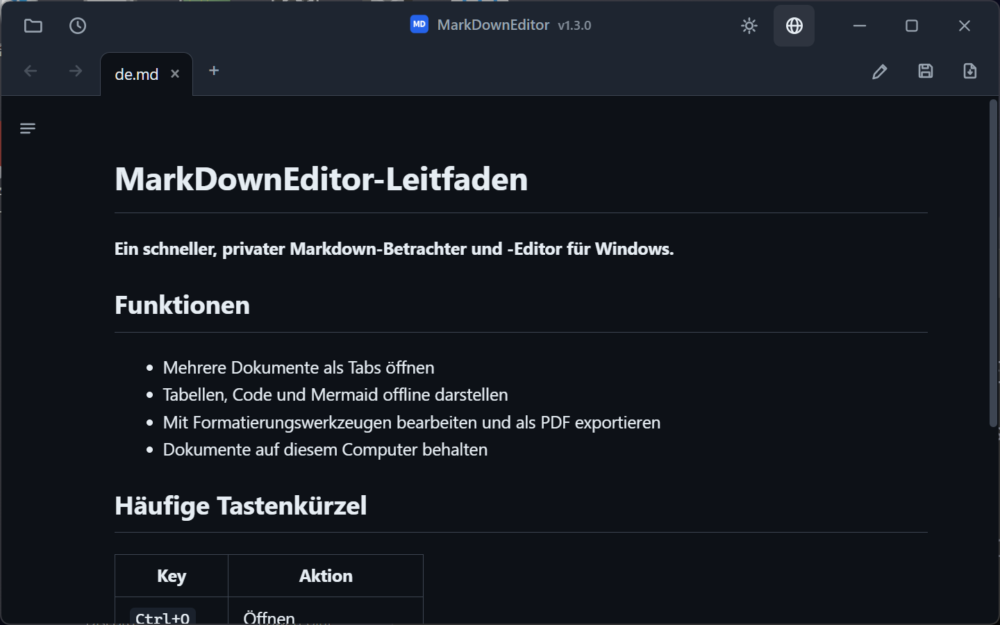
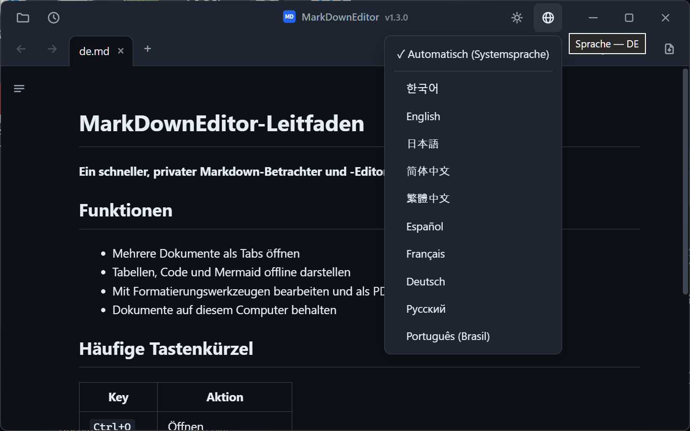

# MarkDownEditor

**Ein schneller, portabler Markdown-Viewer & -Editor für Windows.**
Doppelklick auf eine `.md`-Datei und sie öffnet sich einfach — keine Installation nötig.

[](LICENSE)


[](https://github.com/jjw1270/MarkdownEditor/releases)
[](https://github.com/jjw1270/MarkdownEditor/releases)

[한국어](README.ko.md) · [English](README.md) · [日本語](README.ja.md) · [简体中文](README.zh-CN.md) · [繁體中文](README.zh-TW.md) · [Español](README.es.md) · [Français](README.fr.md) · **Deutsch** · [Русский](README.ru.md) · [Português (Brasil)](README.pt-BR.md)

### ⬇️ [Windows-Installer](https://github.com/jjw1270/MarkdownEditor/releases/latest/download/MarkDownEditor-Setup-x64.exe) &nbsp;·&nbsp; [Portable ZIP](https://github.com/jjw1270/MarkdownEditor/releases/latest/download/MarkDownEditor-standalone.zip) &nbsp;·&nbsp; <sub>[Was ist neu](https://github.com/jjw1270/MarkdownEditor/releases/latest)</sub>



## Highlights

- **Standardmäßig portabel** — entpacken und starten. Die WebView2-Laufzeit ist gebündelt; Einstellungen und Cache bleiben neben der Exe. Ist dieser Ordner schreibgeschützt, wird stattdessen `%TEMP%\MarkDownEditor` verwendet.
- **Automatische Updates** — die App prüft beim Start unauffällig GitHub Releases; gibt es eine neue Version, erscheint ein roter Punkt neben der Versionsanzeige in der Titelleiste. Klicken Sie auf die Version → **Neue Version verfügbar**; das Update läuft direkt in der App mit Fortschrittsbalken — Einstellungen und Sitzung bleiben erhalten. (Das automatische Update — anonyme Versionsprüfung und Download nur bei von Ihnen gestartetem Update — ist der einzige Netzwerkzugriff der App; es werden niemals Dokumente oder persönliche Daten gesendet.)
- **Ein Fenster, viele Tabs** — jede Datei öffnet sich als Tab in einem einzigen Fenster (Einzelinstanz über Mutex + Named Pipe). Tabs lassen sich per Drag & Drop umsortieren und mit `Ctrl+Tab` durchschalten.
- **Alle Links funktionieren** — `.md`-Links öffnen sich in einem neuen Tab, Weblinks im Browser, Ordner im Explorer, andere Dokumente in ihrer Standard-App. Dokumentübergreifende Anker (`doc.md#abschnitt`) werden unterstützt.
- **Zurück / Vorwärts** — Symbolleisten-Buttons, `Alt+←`/`Alt+→` oder Maustasten 4/5.
- **Rendering im GitHub-Stil** — Tabellen, Code-Hervorhebung (offline) und **mermaid-Diagramme** (offline, an das Design angepasst).
- **Inhaltsverzeichnis-Seitenleiste** — mit Scroll-Spy-Hervorhebung des aktuellen Abschnitts.
- **Bearbeiten ↔ Vorschau** — `Ctrl+E`, die Scrollposition wird zwischen beiden Modi synchronisiert.
- **Formatierungsleiste** — erscheint im Bearbeitungsmodus: Fett, Überschriften, Listen, Kontrollkästchen, Zitat, Code, Link, Tabelle, Trennlinie — je ein Klick, **keine Markdown-Kenntnisse nötig** (alles mit `Ctrl+Z` rückgängig zu machen).
- **Kontextmenüs** — Rechtsklick in der Vorschau (Kopieren, Link öffnen, Linkadresse kopieren, Bild anzeigen, Suchen) oder im Editor (Ausschneiden/Kopieren/Einfügen/Alles auswählen).
- **Suchen / Ersetzen** — `Ctrl+F` funktioniert in Vorschau (Hervorhebung aller Treffer) und Bearbeitung; `Ctrl+H` ersetzt im Bearbeitungsmodus.
- **PDF-Export** — der `📄`-Button neben Speichern oder `Ctrl+P`, stets im hellen Design.
- **Bilder aus der Zwischenablage einfügen** — werden in einem `images/`-Ordner neben dem Dokument gespeichert, der Link wird automatisch eingefügt.
- **Automatisches Neuladen bei externen Änderungen** — Änderungen anderer Programme (IDE, Editor) aktualisieren den offenen Tab; Ihre ungespeicherten Änderungen werden nie stillschweigend überschrieben.
- **Automatische Sicherung & Absturzwiederherstellung** — ungespeicherte Änderungen werden alle 30 s gesichert und beim nächsten Start zur Wiederherstellung angeboten.
- **Sitzungswiederherstellung** — beim Start ohne Datei werden die zuletzt geöffneten Tabs wieder geöffnet. Zuletzt verwendete Dateien über den 🕘-Button.
- **Koreanische Kodierungserkennung** — CP949/EUC-KR-Dateien ohne BOM öffnen sich ebenso korrekt wie UTF-8.
- **Dunkles / helles Design** — Umschalten mit dem `🌙`/`☀`-Button in der Titelleiste, wird gemerkt — einschließlich der Windows-Titelleiste.
- **Oberfläche in 10 Sprachen** — 한국어, English, 日本語, 简体中文, 繁體中文, Español, Français, Deutsch, Русский, Português. Folgt standardmäßig der Systemsprache; jederzeit über den `🌐`-Button umschaltbar.
- **Kompakte Oberfläche im Editor-Stil** — Tabs und Werkzeuge sitzen in einer eigenen Titelleiste (freie Fläche ziehen zum Verschieben, Doppelklick zum Maximieren).



## 🚀 Installation

Zwei Pakete stehen für Windows 10 ab Version 1809 und Windows 11 (x64) bereit. Keines benötigt Administratorrechte.

| Paket | Geeignet für | Größe | Laufzeit und Daten |
|---|---|---:|---|
| **[Windows-Installer](https://github.com/jjw1270/MarkdownEditor/releases/latest/download/MarkDownEditor-Setup-x64.exe)** | Normaler täglicher Einsatz | ca. 45 MB | Installation pro Benutzer, automatisch gewartetes Evergreen WebView2, Startmenü und „Öffnen mit“. Daten unter `%LOCALAPPDATA%\MarkDownEditor`. Internet ist nur nötig, wenn WebView2 fehlt; bei einem Fehler der Voraussetzung schlägt Setup eindeutig fehl. |
| **[Portable ZIP](https://github.com/jjw1270/MarkdownEditor/releases/latest/download/MarkDownEditor-standalone.zip)** | USB, offline und ohne Installation | ca. 325 MB | Enthält die feste WebView2-Laufzeit; Daten liegen, wenn möglich, neben der App. |

### Portable Variante

**⬇️ [MarkDownEditor-standalone.zip](https://github.com/jjw1270/MarkdownEditor/releases/latest/download/MarkDownEditor-standalone.zip)** — dieser Link zeigt **immer auf die neueste Version**.

| | |
|---|---|
| **Größe** | ca. 325 MB — die vollständige WebView2-Laufzeit ist für den Offline-Betrieb enthalten |
| **Voraussetzung** | Windows 10 oder 11, 64-Bit. Sonst nichts. |
| **Mehr** | [Alle Releases](https://github.com/jjw1270/MarkdownEditor/releases) · [Was in dieser Version neu ist](https://github.com/jjw1270/MarkdownEditor/releases/latest) · [Vollständiges Changelog](CHANGELOG.md) |

<details>
<summary><b>Lieber im Terminal?</b> Herunterladen, entpacken und starten mit einem PowerShell-Block</summary>

```powershell
$dest = "$env:LOCALAPPDATA\Programs\MarkDownEditor-Portable"
$zip  = "$env:TEMP\MarkDownEditor-standalone.zip"

Invoke-WebRequest "https://github.com/jjw1270/MarkdownEditor/releases/latest/download/MarkDownEditor-standalone.zip" -OutFile $zip
Expand-Archive $zip -DestinationPath $dest -Force
Remove-Item $zip

Start-Process "$dest\MarkDownEditor.exe"
```

Zum Aktualisieren später denselben Block erneut ausführen — oder einfach die unten beschriebene In-App-Aktualisierung nutzen.

</details>

### Schritt 2 — Entpacken und starten

Entpacken Sie den Ordner an einen beschreibbaren Ort: `C:\Tools\MarkDownEditor`, den Desktop, einen USB-Stick — das spielt keine Rolle. Starten Sie dann **`MarkDownEditor.exe`**.

Der Ordner enthält neben `MarkDownEditor.exe` noch `web/` (die Oberfläche), `Runtime/` (die gebündelte WebView2-Laufzeit) und `WebView2Data/` (Cache). Solange sie zusammenbleiben, können Sie den gesamten Ordner verschieben, kopieren oder auf einem USB-Stick mitnehmen.

> **Der blaue SmartScreen-Dialog beim ersten Start ist zu erwarten.** Die Datei ist nicht signiert, daher meldet Windows *„Der Computer wurde durch Windows geschützt"*. Klicken Sie auf **Weitere Informationen → Trotzdem ausführen**. Das erscheint nur einmal.
> Wenn Sie keine unsignierte Binärdatei ausführen möchten: Der Bau aus dem Quellcode braucht zwei Befehle — siehe *Aus dem Quellcode bauen* weiter unten.

### Schritt 3 — Als Standard-App für `.md` festlegen *(darum geht es eigentlich)*

Danach genügt ein Doppelklick auf eine Markdown-Datei im Explorer, und sie öffnet sich sofort gerendert.

1. Rechtsklick auf eine beliebige `.md`-Datei im Explorer
2. **Öffnen mit → Andere App auswählen**
3. `MarkDownEditor.exe` auswählen — falls nicht aufgeführt, nach unten scrollen und **App auf dem PC auswählen** verwenden
4. **Immer diese App zum Öffnen von .md-Dateien verwenden** ankreuzen, dann **OK**

Für `.markdown` und `.txt` funktioniert das genauso.

### Aktualisieren

Beim Start prüft die App GitHub Releases anonym. Nach dem Klick auf **Aktualisieren** werden URL, Größe, SHA-256, Paketstruktur und Version geprüft. Die portable Ausgabe tauscht ihr ZIP atomar aus; die installierte Ausgabe startet den nächsten geprüften Benutzer-Installer. Einstellungen und Sitzung bleiben erhalten.

### Deinstallieren

- **Installierte Ausgabe:** über **Einstellungen → Apps → Installierte Apps** entfernen. Programm, Verknüpfungen und eigene „Öffnen mit“-Einträge werden gelöscht; `%LOCALAPPDATA%\MarkDownEditor` bleibt für eine sichere Neuinstallation erhalten.
- **Portable Ausgabe:** den App-Ordner löschen; nach Ausführung aus einem schreibgeschützten Ort zusätzlich `%TEMP%\MarkDownEditor` entfernen.

## Tastenkürzel

| Taste | Aktion |
|------|------|
| `Ctrl+O` | Öffnen (Mehrfachauswahl möglich) |
| `Ctrl+N` | Neuer Dokument-Tab |
| `Ctrl+S` | Speichern |
| `Ctrl+P` | Als PDF exportieren |
| `Ctrl+E` | Bearbeiten / Vorschau umschalten |
| `Ctrl+F` / `Ctrl+H` | Suchen / Ersetzen |
| `Ctrl+B` / `Ctrl+I` | Fett / Kursiv (Bearbeitungsmodus, umschaltbar) |
| `Ctrl+K` | Link einfügen (Bearbeitungsmodus — die Adresse ist vorausgewählt) |
| `Tab` / `Shift+Tab` | Einrücken / Ausrücken (mehrzeilig) |
| `Ctrl+Tab` / `Ctrl+Shift+Tab` | Nächster / vorheriger Tab |
| `Ctrl+W` | Tab schließen |
| `Alt+←` / `Alt+→` | Zurück / Vorwärts |

## Datenschutz

- Dokumente werden lokal verarbeitet und nie hochgeladen. Es gibt keine Telemetrie und keine Kennung.
- Während der App-Nutzung dient das Netzwerk nur der anonymen GitHub-Release-Prüfung und einem von Ihnen gestarteten Update. Bei der Erstinstallation kann Setup WebView2 von Microsoft laden, falls es in Windows fehlt.
- Installierte Daten liegen unter `%LOCALAPPDATA%\MarkDownEditor`; portable Daten liegen in `WebView2Data/` oder, bei schreibgeschütztem Ort, in `%TEMP%\MarkDownEditor`.
- Eine strenge Content Security Policy blockiert Skripte, Plug-ins, Änderungen der Basis-URL und automatische Anfragen an entfernte Bilder. Lokale Bilder werden lokal eingebettet.

## Aus dem Quellcode bauen

```powershell
cd src
dotnet publish -c Release -r win-x64 --self-contained true `
  -p:PublishSingleFile=true -p:IncludeNativeLibrariesForSelfExtract=true
```

Ausgabe: `src/bin/Release/net10.0-windows/win-x64/publish/MarkDownEditor.exe`.
Legen Sie den Ordner `web/` (und optional eine WebView2 Fixed Version Runtime als `Runtime/`) neben die Exe.

### Architektur in einem Absatz

Die C#-Seite (WPF) übernimmt Datei-E/A, die Einzelinstanz-Pipe und den Fensterrahmen; die Web-Seite (Vanilla JS in einem einzigen WebView2) besitzt alle Dokumentpuffer und den Tab-Zustand. Beide kommunizieren ausschließlich über `postMessage`. Das Rendering nutzt marked + highlight.js + mermaid, alles für den Offline-Betrieb gebündelt. Die vollständige Funktionsübersicht finden Sie in [README.ko.md](README.ko.md) (Koreanisch) oder [README.md](README.md) (Englisch).

## Feedback

Fehlermeldungen und Funktionswünsche sind auf [GitHub Issues](https://github.com/jjw1270/MarkdownEditor/issues/new/choose) willkommen — oder klicken Sie in der App auf die Versionsanzeige neben dem Titel (das Fehlerformular ist mit Ihrer aktuellen Version vorausgefüllt).

## Lizenz

MIT — siehe [LICENSE](LICENSE). Gebündelte Drittanbieter-Komponenten sind in
[THIRD-PARTY-NOTICES.md](THIRD-PARTY-NOTICES.md) aufgeführt (Hinweis: das mermaid-Bündel enthält einen kleinen dokumentierten lokalen Patch).
