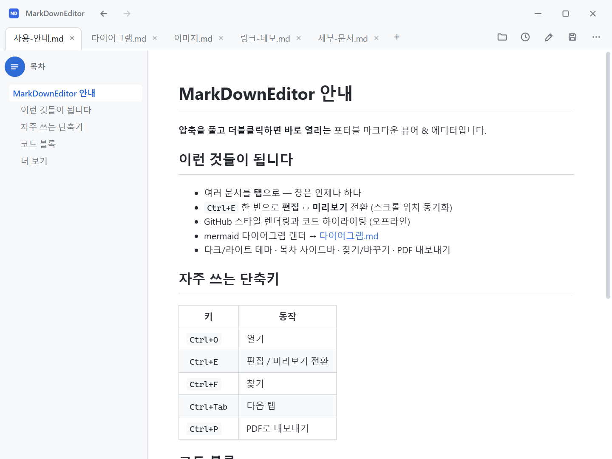
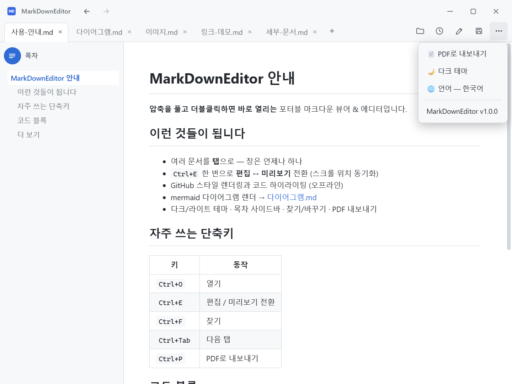

# MarkDownEditor

**A fast, portable Markdown viewer & editor for Windows.**
Double-click a `.md` file and it just opens — no installation required.

[](LICENSE)


[](https://github.com/jjw1270/MarkdownEditor/releases)
[](https://github.com/jjw1270/MarkdownEditor/releases)

[한국어 README](README.md)



## Highlights

- **Portable** — unzip and run. The WebView2 runtime is bundled; settings and cache stay next to the exe, leaving no traces on the system.
- **One window, many tabs** — every file opens as a tab in a single window (single-instance via mutex + named pipe). Tabs can be reordered by drag & drop, cycled with `Ctrl+Tab`.
- **All links work** — `.md` links open in a new tab, web links in your browser, folders in Explorer, other documents in their default apps. Cross-document anchors (`doc.md#section`) are supported.
- **Back / Forward** — toolbar buttons, `Alt+←`/`Alt+→`, or mouse buttons 4/5.
- **GitHub-style rendering** — tables, code highlighting (offline), and **mermaid diagrams** (offline, theme-aware).
- **Table of contents sidebar** — with scroll-spy highlighting of the current section.
- **Edit ↔ Preview** — `Ctrl+E`, with scroll position synchronized between the two modes.
- **Find / Replace** — `Ctrl+F` works in both preview (full-match highlighting) and edit mode; `Ctrl+H` replaces in edit mode.
- **PDF export** — from the `⋯` menu or `Ctrl+P`, always in light theme.
- **Paste images from clipboard** — saved to an `images/` folder next to the document, link inserted automatically.
- **Auto reload on external change** — edits from other programs (IDE, editor) refresh the open tab; your unsaved edits are never silently overwritten.
- **Auto backup & crash recovery** — unsaved changes are snapshotted every 30 s and offered for recovery on next start.
- **Session restore** — when launched without a file, the previously open tabs are reopened. Recent files are available from the 🕘 button.
- **Korean encoding detection** — BOM-less CP949/EUC-KR files open correctly alongside UTF-8.
- **Dark / Light theme** — toggled from the `⋯` menu, remembered across runs, including the Windows title bar.
- **Localized UI — 10 languages** — 한국어, English, 日本語, 简体中文, 繁體中文, Español, Français, Deutsch, Русский, Português. Follows the OS language by default; switch anytime from the `⋯` menu → Language.
- **Notepad-style compact chrome** — tabs and tools live in a custom title bar (drag the blank area to move, double-click to maximize).



## Getting started

1. Download `MarkDownEditor-standalone.zip` from Releases and **unzip anywhere**.
2. Run `MarkDownEditor.exe`. There is no installer.
3. (Optional) Set it as the default app for `.md` files: right-click a `.md` file → *Open with* → *Choose another app* → select `MarkDownEditor.exe` and check *Always*.

> **SmartScreen note** — the binary is not code-signed, so Windows may show an "unknown publisher" warning on first run. Choose *More info → Run anyway*, or build from source below.

### Requirements

- Windows 10 / 11 (64-bit)
- No WebView2 installation needed — a fixed-version runtime is bundled. (Builds without the bundle fall back to the system-installed Evergreen runtime.)

## Keyboard shortcuts

| Key | Action |
|------|------|
| `Ctrl+O` | Open (multi-select supported) |
| `Ctrl+N` | New document tab |
| `Ctrl+S` | Save |
| `Ctrl+P` | Export as PDF |
| `Ctrl+E` | Toggle edit / preview |
| `Ctrl+F` / `Ctrl+H` | Find / Replace |
| `Ctrl+B` / `Ctrl+I` | Bold / Italic (edit mode, toggles) |
| `Tab` / `Shift+Tab` | Indent / Outdent (multi-line aware) |
| `Ctrl+Tab` / `Ctrl+Shift+Tab` | Next / previous tab |
| `Ctrl+W` | Close tab |
| `Alt+←` / `Alt+→` | Back / Forward |

## Building from source

```powershell
cd src
dotnet publish -c Release -r win-x64 --self-contained true `
  -p:PublishSingleFile=true -p:IncludeNativeLibrariesForSelfExtract=true
```

Output: `src/bin/Release/net9.0-windows/win-x64/publish/MarkDownEditor.exe`.
Place the `web/` folder (and optionally a WebView2 Fixed Version Runtime as `Runtime/`) next to the exe.

### Architecture in one paragraph

The C# (WPF) side owns file I/O, the single-instance pipe, and window chrome; the web side (vanilla JS in a single WebView2) owns all document buffers and tab state. The two communicate only via `postMessage`. Rendering uses marked + highlight.js + mermaid, all bundled for offline use. See `README.md` for the full feature tour (Korean).

## License

MIT — see [LICENSE](LICENSE). Bundled third-party components are listed in
[THIRD-PARTY-NOTICES.md](THIRD-PARTY-NOTICES.md) (note: the mermaid bundle carries a small local patch, documented there).
