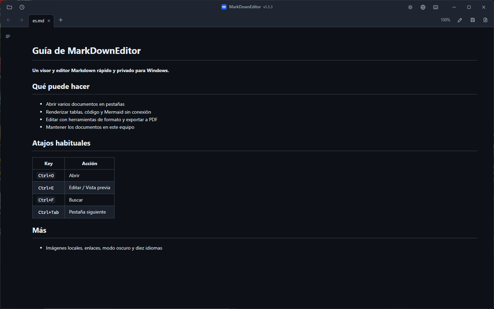
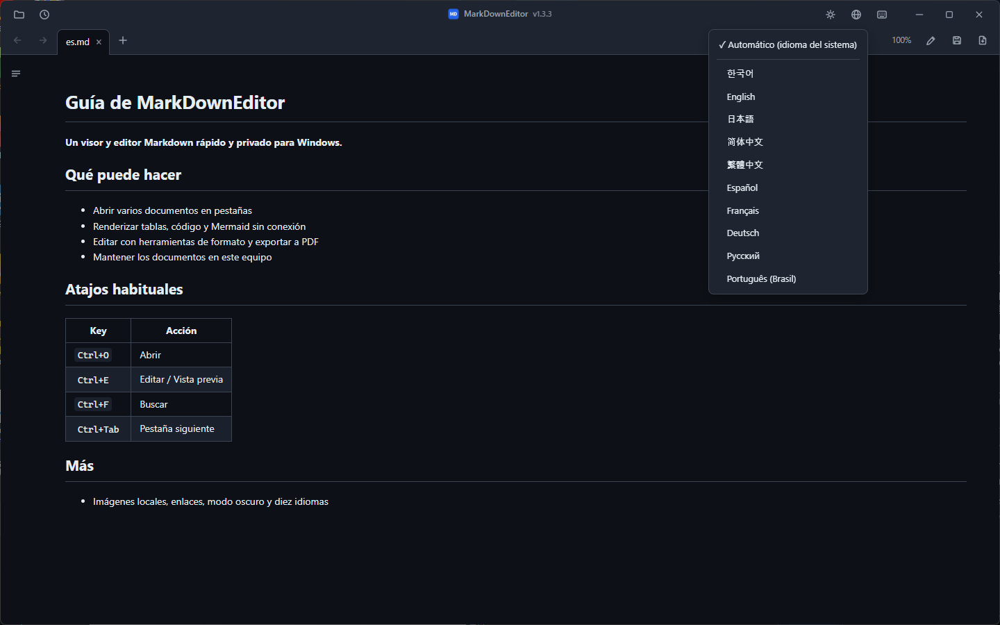

# MarkDownEditor

MarkDownEditor es un visor y editor de Markdown para Windows 10 y 11. Está disponible como instalador o ZIP portátil y no usa cuentas ni telemetría.

[한국어](README.ko.md) · [English](README.md) · [日本語](README.ja.md) · [简体中文](README.zh-CN.md) · [繁體中文](README.zh-TW.md) · **Español** · [Français](README.fr.md) · [Deutsch](README.de.md) · [Русский](README.ru.md) · [Português (Brasil)](README.pt-BR.md)

### [Descargar desde GitHub Releases](https://github.com/jjw1270/MarkdownEditor/releases/latest)

## Características

- **Dos paquetes** — el instalador integra la aplicación en Windows para el usuario actual. El ZIP portátil incluye WebView2 y guarda sus datos junto al ejecutable cuando la carpeta lo permite.
- **Actualización automática** — la aplicación consulta GitHub Releases de forma anónima al iniciar. La descarga solo comienza cuando eliges actualizar y no se envían documentos.
- **Una ventana, muchas pestañas** — cada archivo se abre como pestaña en una sola ventana. Las pestañas se reordenan arrastrando y se recorren con `Ctrl+Tab`.
- **Enlaces de documentos** — los enlaces `.md` se abren en una pestaña nueva, los enlaces web en el navegador, las carpetas en el Explorador y los documentos compatibles en su aplicación predeterminada. Se admiten anclas entre documentos (`doc.md#sección`).
- **Atrás / Adelante** — botones de la barra de herramientas, `Alt+←`/`Alt+→`, o botones 4/5 del ratón.
- **Renderizado estilo GitHub** — tablas, resaltado de código (sin conexión) y **diagramas mermaid** (sin conexión, adaptados al tema).
- **Barra lateral de índice** — con resaltado de la sección actual según el desplazamiento (scroll-spy).
- **Edición ↔ Vista previa** — `Ctrl+E`, con la posición de desplazamiento sincronizada entre ambos modos.
- **Barra de formato** — inserta negrita, títulos, listas, casillas, citas, código, enlaces, tablas y separadores. Los cambios se pueden deshacer con `Ctrl+Z`.
- **Menús contextuales** — clic derecho en la vista previa (copiar, abrir enlace, copiar dirección, ver imagen, buscar) o en el editor (cortar/copiar/pegar/seleccionar todo).
- **Buscar / Reemplazar** — `Ctrl+F` funciona tanto en la vista previa (resaltado de todas las coincidencias) como en edición; `Ctrl+H` reemplaza en modo edición.
- **Exportar a PDF** — el botón `📄` junto a Guardar, o `Ctrl+P`, siempre en tema claro.
- **Pegar imágenes del portapapeles** — se guardan en una carpeta `images/` junto al documento y el enlace se inserta automáticamente.
- **Recarga automática ante cambios externos** — las ediciones de otros programas (IDE, editor) actualizan la pestaña abierta; tus cambios sin guardar nunca se sobrescriben en silencio.
- **Copia de seguridad automática y recuperación** — los cambios sin guardar se capturan cada 30 s y se ofrecen para recuperar en el siguiente inicio.
- **Restauración de sesión** — al iniciar sin archivo, se reabren las pestañas anteriores. Los archivos recientes están en el botón 🕘.
- **Detección de codificación coreana** — los archivos CP949/EUC-KR sin BOM se abren correctamente junto con UTF-8.
- **Tema oscuro / claro** — se alterna con el botón `🌙`/`☀` de la barra de título, se recuerda entre sesiones e incluye la barra de título de Windows.
- **Interfaz en 10 idiomas** — 한국어, English, 日本語, 简体中文, 繁體中文, Español, Français, Deutsch, Русский, Português. Sigue el idioma del sistema por defecto; cámbialo cuando quieras desde el botón `🌐`.
- **Zoom solo del documento** — `Ctrl+rueda` cambia el texto de la vista previa y del editor sin ampliar pestañas ni barras. Haz clic en el porcentaje para abrir los controles `−`/`+`; haz clic en el valor central o pulsa `Ctrl+0` para volver al 100 %. El nivel se conserva entre ejecuciones.
- **Referencia de atajos** — usa el botón de teclado de la barra de título o `Ctrl+/` para consultar los atajos principales sin salir del documento.
- **Interfaz compacta estilo Bloc de notas** — pestañas y herramientas integradas en una barra de título personalizada (arrastra la zona vacía para mover, doble clic para maximizar).

## Instalación

Hay dos paquetes para Windows 10 versión 1809 o posterior y Windows 11 (x64). Ninguno requiere permisos de administrador.

| Paquete | Recomendado para | Tamaño | Runtime y datos |
|---|---|---:|---|
| **Instalador de Windows** | Uso diario normal | aprox. 45 MB | Instalación por usuario, WebView2 Evergreen con actualizaciones de seguridad, menú Inicio y «Abrir con». Datos en `%LOCALAPPDATA%\MarkDownEditor`. Solo necesita Internet si falta WebView2; si no puede instalarse el requisito, el instalador muestra un error. |
| **ZIP portátil** | USB, uso sin conexión y sin instalación | aprox. 325 MB | Incluye WebView2 Fixed Runtime; los datos quedan junto a la aplicación cuando se puede escribir. |

### Opción portátil

| | |
|---|---|
| **Tamaño** | aprox. 325 MB — incluye WebView2 completo para funcionar sin conexión |
| **Requisitos** | Windows 10 u 11, 64 bits. Nada más. |
| **Más** | [Todas las versiones](https://github.com/jjw1270/MarkdownEditor/releases) · [Novedades de esta versión](https://github.com/jjw1270/MarkdownEditor/releases/latest) · [Registro de cambios completo](CHANGELOG.md) |

### Paso 2 — Descomprimir y ejecutar

Extrae la carpeta en cualquier sitio donde tengas permiso de escritura: `C:\Tools\MarkDownEditor`, el Escritorio, una memoria USB — da igual. Después ejecuta **`MarkDownEditor.exe`**.

La carpeta contiene `MarkDownEditor.exe` más `web/` (la interfaz), `Runtime/` (el WebView2 incluido) y `WebView2Data/` (caché). Mientras se mantengan juntos, puedes mover, copiar o llevarte la carpeta entera a donde quieras.

> **El aviso azul de SmartScreen en el primer arranque es normal.** El ejecutable no está firmado, así que Windows muestra *"Windows protegió su PC"*. Pulsa **Más información → Ejecutar de todas formas**. Solo aparece una vez.
> Si prefieres compilar la aplicación, consulta la [guía de desarrollo en inglés](DEVELOPMENT.md).

### Paso 3 — Ponerlo como aplicación predeterminada para `.md`

Una vez configurado, doble clic en cualquier archivo Markdown del Explorador y se abre renderizado al instante.

1. Clic derecho en cualquier archivo `.md` del Explorador
2. **Abrir con → Elegir otra aplicación**
3. Selecciona `MarkDownEditor.exe` — si no aparece en la lista, baja y usa **Elegir una aplicación en el PC**
4. Marca **Usar siempre esta aplicación para abrir los archivos .md** y pulsa **Aceptar**

Lo mismo sirve para `.markdown` y `.txt` si quieres abrirlos igual.

### Actualizaciones

Al iniciar, la aplicación consulta GitHub Releases de forma anónima. Tras pulsar **Actualizar**, verifica URL, tamaño, SHA-256, estructura y versión. La edición portátil sustituye el ZIP de forma atómica; la instalada ejecuta el siguiente instalador verificado. Se conservan la configuración y la sesión.

### Desinstalación

- **Edición instalada:** desinstálala desde **Configuración → Aplicaciones → Aplicaciones instaladas**. Se eliminan el programa, los accesos directos y sus entradas «Abrir con»; `%LOCALAPPDATA%\MarkDownEditor` se conserva para una reinstalación segura.
- **Edición portátil:** borra su carpeta; si se ejecutó desde una ubicación de solo lectura, borra también `%TEMP%\MarkDownEditor`.

## Atajos de teclado

| Tecla | Acción |
|------|------|
| `Ctrl+O` | Abrir (selección múltiple) |
| `Ctrl+N` | Nueva pestaña de documento |
| `Ctrl+S` | Guardar |
| `Ctrl+P` | Exportar como PDF |
| `Ctrl+E` | Alternar edición / vista previa |
| `Ctrl+F` / `Ctrl+H` | Buscar / Reemplazar |
| `Ctrl+B` / `Ctrl+I` | Negrita / Cursiva (modo edición, conmutable) |
| `Ctrl+K` | Insertar enlace (modo edición — la dirección queda preseleccionada) |
| `Tab` / `Shift+Tab` | Aumentar / reducir sangría (multilínea) |
| `Ctrl+Tab` / `Ctrl+Shift+Tab` | Pestaña siguiente / anterior |
| `Ctrl+W` | Cerrar pestaña |
| `Ctrl+rueda` / `Ctrl++` / `Ctrl+-` | Ampliar / reducir el documento (se recuerda) |
| `Ctrl+0` | Restablecer el zoom del documento al 100 % |
| `Ctrl+/` | Ver los atajos de teclado |
| `Alt+←` / `Alt+→` | Atrás / Adelante |

## Privacidad

- Los documentos se procesan localmente y nunca se suben. No hay telemetría ni identificadores.
- Durante el uso, la red solo sirve para consultar GitHub Releases y descargar una actualización iniciada por ti. En la primera instalación, Setup puede descargar WebView2 de Microsoft si falta en Windows.
- La edición instalada guarda datos en `%LOCALAPPDATA%\MarkDownEditor`; la portátil usa `WebView2Data/` o `%TEMP%\MarkDownEditor` si la ubicación es de solo lectura.
- La vista previa bloquea el contenido ejecutable y no carga imágenes remotas automáticamente. Las imágenes locales permanecen en tu equipo.

## Comentarios

Los informes de errores y las sugerencias de funciones son bienvenidos en [GitHub Issues](https://github.com/jjw1270/MarkdownEditor/issues/new/choose) — o haz clic en la etiqueta de versión junto al título dentro de la aplicación (el formulario de error se rellena con tu versión actual).

## Licencia

MIT — consulta [LICENSE](LICENSE). Los componentes de terceros incluidos se listan en
[THIRD-PARTY-NOTICES.md](THIRD-PARTY-NOTICES.md).
