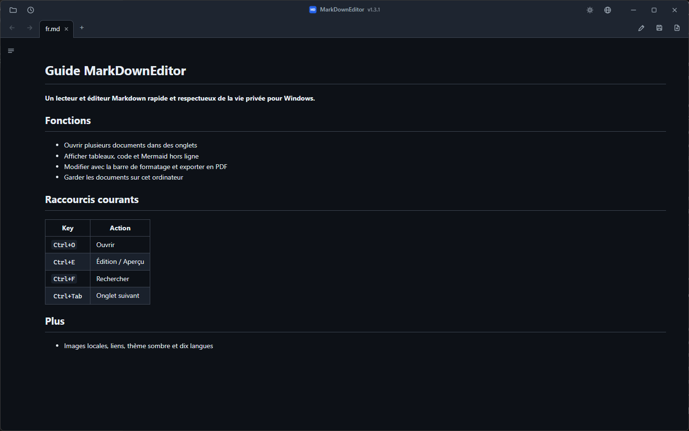
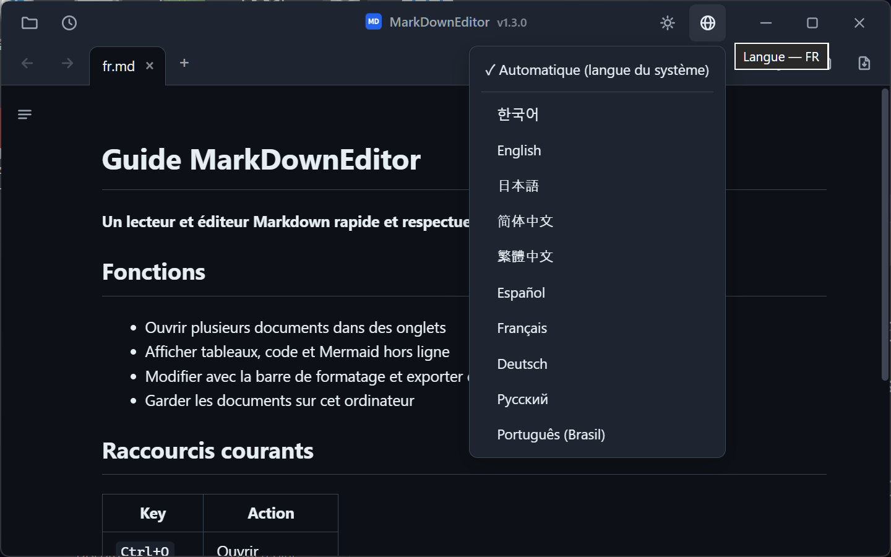

# MarkDownEditor

MarkDownEditor est un visualiseur et éditeur Markdown pour Windows 10 et 11. Il est proposé sous forme d'installateur ou de ZIP portable, sans compte ni télémétrie.

[](LICENSE)


[](https://github.com/jjw1270/MarkdownEditor/releases)
[](https://github.com/jjw1270/MarkdownEditor/releases)

[한국어](README.ko.md) · [English](README.md) · [日本語](README.ja.md) · [简体中文](README.zh-CN.md) · [繁體中文](README.zh-TW.md) · [Español](README.es.md) · **Français** · [Deutsch](README.de.md) · [Русский](README.ru.md) · [Português (Brasil)](README.pt-BR.md)



## Fonctionnalités

- **Deux paquets** — l'installateur intègre l'application à Windows pour l'utilisateur actuel. Le ZIP portable contient WebView2 et conserve ses données près de l'exécutable lorsque le dossier est accessible en écriture.
- **Mise à jour automatique** — l'application consulte anonymement GitHub Releases au démarrage. Le téléchargement ne commence que lorsque vous lancez la mise à jour et aucun document n'est transmis.
- **Une fenêtre, plusieurs onglets** — chaque fichier s'ouvre dans un onglet d'une fenêtre unique. Les onglets se réordonnent par glisser-déposer et se parcourent avec `Ctrl+Tab`.
- **Liens de document** — les liens `.md` s'ouvrent dans un nouvel onglet, les liens web dans le navigateur, les dossiers dans l'Explorateur et les documents pris en charge dans leur application par défaut. Les ancres entre documents (`doc.md#section`) sont prises en charge.
- **Précédent / Suivant** — boutons de la barre d'outils, `Alt+←`/`Alt+→`, ou boutons 4/5 de la souris.
- **Rendu façon GitHub** — tableaux, coloration syntaxique (hors ligne) et **diagrammes mermaid** (hors ligne, adaptés au thème).
- **Sommaire latéral** — avec mise en évidence de la section en cours de lecture (scroll-spy).
- **Édition ↔ Aperçu** — `Ctrl+E`, avec position de défilement synchronisée entre les deux modes.
- **Barre de mise en forme** — insère du gras, des titres, des listes, des cases à cocher, des citations, du code, des liens, des tableaux et des séparateurs. Les modifications restent annulables avec `Ctrl+Z`.
- **Menus contextuels** — clic droit dans l'aperçu (copier, ouvrir le lien, copier l'adresse, afficher l'image, rechercher) ou dans l'éditeur (couper/copier/coller/tout sélectionner).
- **Rechercher / Remplacer** — `Ctrl+F` fonctionne dans l'aperçu (surlignage de toutes les correspondances) comme en édition ; `Ctrl+H` remplace en mode édition.
- **Export PDF** — le bouton `📄` à côté d'Enregistrer, ou `Ctrl+P`, toujours en thème clair.
- **Coller des images du presse-papiers** — enregistrées dans un dossier `images/` à côté du document, lien inséré automatiquement.
- **Rechargement automatique en cas de modification externe** — les modifications d'autres programmes (IDE, éditeur) actualisent l'onglet ouvert ; vos modifications non enregistrées ne sont jamais écrasées en silence.
- **Sauvegarde automatique et récupération** — les modifications non enregistrées sont capturées toutes les 30 s et proposées à la récupération au démarrage suivant.
- **Restauration de session** — lancé sans fichier, l'application rouvre les onglets précédents. Les fichiers récents sont accessibles via le bouton 🕘.
- **Détection de l'encodage coréen** — les fichiers CP949/EUC-KR sans BOM s'ouvrent correctement, comme l'UTF-8.
- **Thème sombre / clair** — bascule avec le bouton `🌙`/`☀` de la barre de titre, mémorisé entre les sessions, barre de titre Windows comprise.
- **Interface en 10 langues** — 한국어, English, 日本語, 简体中文, 繁體中文, Español, Français, Deutsch, Русский, Português. Suit la langue du système par défaut ; changez à tout moment via le bouton `🌐`.
- **Zoom du document uniquement** — `Ctrl+molette` modifie le texte de l’aperçu et de l’éditeur sans agrandir les onglets ni les barres. Cliquez sur le pourcentage ou appuyez sur `Ctrl+0` pour revenir à 100 % ; le niveau est mémorisé.
- **Aide des raccourcis** — utilisez le bouton clavier de la barre de titre ou `Ctrl+/` pour consulter les principaux raccourcis sans quitter le document.
- **Interface compacte façon Bloc-notes** — onglets et outils intégrés dans une barre de titre personnalisée (faites glisser la zone vide pour déplacer, double-cliquez pour agrandir).



## Installation

Deux paquets sont proposés pour Windows 10 version 1809 ou ultérieure et Windows 11 (x64). Aucun ne demande de droits administrateur.

| Paquet | Usage conseillé | Taille | Runtime et données |
|---|---|---:|---|
| **[Programme d'installation Windows](https://github.com/jjw1270/MarkdownEditor/releases/latest/download/MarkDownEditor-Setup-x64.exe)** | Usage quotidien | env. 45 Mo | Installation par utilisateur, WebView2 Evergreen maintenu automatiquement, menu Démarrer et « Ouvrir avec ». Données dans `%LOCALAPPDATA%\MarkDownEditor`. Internet n'est requis que si WebView2 manque ; l'installation signale une erreur si ce prérequis échoue. |
| **[ZIP portable](https://github.com/jjw1270/MarkdownEditor/releases/latest/download/MarkDownEditor-standalone.zip)** | USB, hors ligne et sans installation | env. 325 Mo | Inclut WebView2 Fixed Runtime ; les données restent près de l'application si l'emplacement est inscriptible. |

### Option portable

**⬇️ [MarkDownEditor-standalone.zip](https://github.com/jjw1270/MarkdownEditor/releases/latest/download/MarkDownEditor-standalone.zip)** — ce lien pointe **toujours vers la dernière version**.

| | |
|---|---|
| **Taille** | env. 325 Mo — le runtime WebView2 complet est inclus pour l'usage hors ligne |
| **Prérequis** | Windows 10 ou 11, 64 bits. Rien d'autre. |
| **Plus** | [Toutes les versions](https://github.com/jjw1270/MarkdownEditor/releases) · [Nouveautés de cette version](https://github.com/jjw1270/MarkdownEditor/releases/latest) · [Journal des modifications complet](CHANGELOG.md) |

<details>
<summary><b>Vous préférez le terminal ?</b> Télécharger, décompresser et lancer en un bloc PowerShell</summary>

```powershell
$dest = "$env:LOCALAPPDATA\Programs\MarkDownEditor-Portable"
$zip  = "$env:TEMP\MarkDownEditor-standalone.zip"

Invoke-WebRequest "https://github.com/jjw1270/MarkdownEditor/releases/latest/download/MarkDownEditor-standalone.zip" -OutFile $zip
Expand-Archive $zip -DestinationPath $dest -Force
Remove-Item $zip

Start-Process "$dest\MarkDownEditor.exe"
```

Pour mettre à jour plus tard, relancez le même bloc — ou utilisez simplement la mise à jour intégrée décrite ci-dessous.

</details>

### Étape 2 — Décompresser et lancer

Extrayez le dossier n'importe où vous avez le droit d'écrire : `C:\Tools\MarkDownEditor`, le Bureau, une clé USB — peu importe. Lancez ensuite **`MarkDownEditor.exe`**.

Le dossier contient `MarkDownEditor.exe` ainsi que `web/` (l'interface), `Runtime/` (le WebView2 embarqué) et `WebView2Data/` (le cache). Tant qu'ils restent ensemble, vous pouvez déplacer, copier ou emporter le dossier entier où vous voulez.

> **La fenêtre bleue SmartScreen au premier lancement est normale.** L'exécutable n'est pas signé, Windows affiche donc *« Windows a protégé votre ordinateur »*. Cliquez sur **Informations complémentaires → Exécuter quand même**. Cela n'apparaît qu'une fois.
> Si vous préférez compiler l'application, consultez le [guide de développement en anglais](DEVELOPMENT.md).

### Étape 3 — En faire l'application par défaut pour `.md`

Une fois cela réglé, un double-clic sur n'importe quel fichier Markdown dans l'Explorateur l'ouvre rendu, instantanément.

1. Clic droit sur un fichier `.md` dans l'Explorateur
2. **Ouvrir avec → Choisir une autre application**
3. Sélectionnez `MarkDownEditor.exe` — s'il n'apparaît pas, descendez et utilisez **Choisir une application sur ce PC**
4. Cochez **Toujours utiliser cette application pour ouvrir les fichiers .md**, puis **OK**

La même chose fonctionne pour `.markdown` et `.txt` si vous le souhaitez.

### Mises à jour

Au démarrage, l'application interroge anonymement GitHub Releases. Après **Mettre à jour**, elle vérifie l'URL, la taille, le SHA-256, la structure et la version. L'édition portable remplace son ZIP atomiquement ; l'édition installée lance l'installateur suivant vérifié. Réglages et session sont conservés.

### Désinstallation

- **Édition installée :** utilisez **Paramètres → Applications → Applications installées**. Le programme, les raccourcis et ses propres entrées « Ouvrir avec » sont supprimés ; `%LOCALAPPDATA%\MarkDownEditor` est conservé pour une réinstallation sûre.
- **Édition portable :** supprimez son dossier ; après une exécution depuis un emplacement en lecture seule, supprimez aussi `%TEMP%\MarkDownEditor`.

## Raccourcis clavier

| Touche | Action |
|------|------|
| `Ctrl+O` | Ouvrir (sélection multiple) |
| `Ctrl+N` | Nouvel onglet de document |
| `Ctrl+S` | Enregistrer |
| `Ctrl+P` | Exporter en PDF |
| `Ctrl+E` | Basculer édition / aperçu |
| `Ctrl+F` / `Ctrl+H` | Rechercher / Remplacer |
| `Ctrl+B` / `Ctrl+I` | Gras / Italique (mode édition, bascule) |
| `Ctrl+K` | Insérer un lien (mode édition — l'adresse est présélectionnée) |
| `Tab` / `Shift+Tab` | Indenter / Désindenter (multiligne) |
| `Ctrl+Tab` / `Ctrl+Shift+Tab` | Onglet suivant / précédent |
| `Ctrl+W` | Fermer l'onglet |
| `Ctrl+molette` / `Ctrl++` / `Ctrl+-` | Agrandir / réduire le document (mémorisé) |
| `Ctrl+0` | Réinitialiser le zoom du document à 100 % |
| `Ctrl+/` | Afficher les raccourcis clavier |
| `Alt+←` / `Alt+→` | Précédent / Suivant |

## Confidentialité

- Les documents sont traités localement et ne sont jamais envoyés. Aucune télémétrie ni aucun identifiant.
- Pendant l'utilisation, le réseau sert uniquement à vérifier GitHub Releases et à télécharger une mise à jour que vous lancez. À la première installation, Setup peut télécharger WebView2 depuis Microsoft s'il manque dans Windows.
- L'édition installée stocke ses données dans `%LOCALAPPDATA%\MarkDownEditor` ; la portable utilise `WebView2Data/` ou `%TEMP%\MarkDownEditor` si l'emplacement est en lecture seule.
- L'aperçu bloque le contenu exécutable et ne charge pas automatiquement les images distantes. Les images locales restent sur votre ordinateur.

## Retours

Signalements de bugs et propositions de fonctionnalités sont les bienvenus sur [GitHub Issues](https://github.com/jjw1270/MarkdownEditor/issues/new/choose) — ou cliquez sur le numéro de version à côté du titre dans l'application (le formulaire de bug est prérempli avec votre version actuelle).

## Licence

MIT — voir [LICENSE](LICENSE). Les composants tiers embarqués sont listés dans
[THIRD-PARTY-NOTICES.md](THIRD-PARTY-NOTICES.md).
