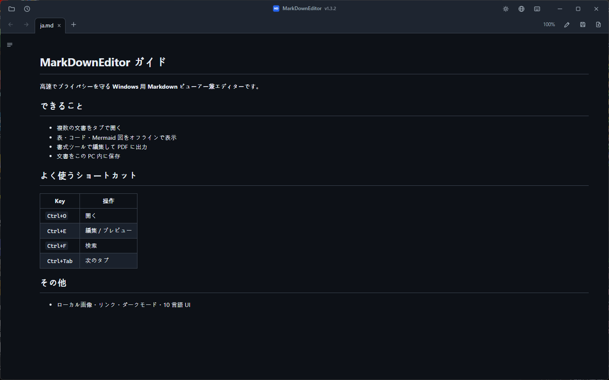
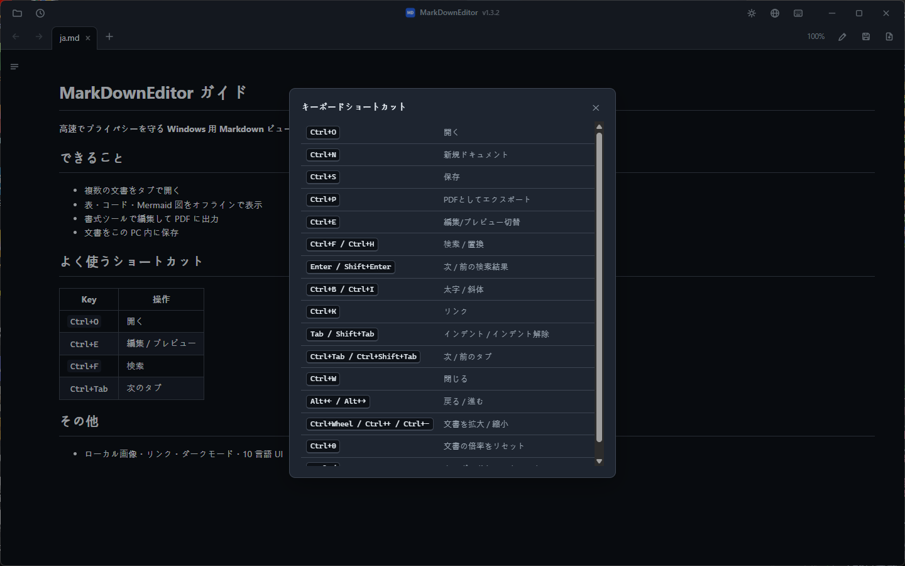

# MarkDownEditor

MarkDownEditor は Windows 10・11 用の Markdown ビューアー兼エディターです。インストーラー版とポータブル ZIP 版があり、アカウントやテレメトリは使用しません。

[한국어](README.ko.md) · [English](README.md) · **日本語** · [简体中文](README.zh-CN.md) · [繁體中文](README.zh-TW.md) · [Español](README.es.md) · [Français](README.fr.md) · [Deutsch](README.de.md) · [Русский](README.ru.md) · [Português (Brasil)](README.pt-BR.md)

### [GitHub Releases からダウンロード](https://github.com/jjw1270/MarkdownEditor/releases/latest)

## 機能

- **2 種類のパッケージ** — インストーラー版は現在のユーザー向けに Windows へ登録します。ポータブル版は WebView2 を同梱し、書き込み可能なら実行ファイルの隣にデータを保存します。
- **自動アップデート** — 起動時に GitHub Releases を匿名で確認します。ダウンロードはユーザーが更新を開始したときだけ行い、文書は送信しません。
- **ウィンドウは 1 つ、ドキュメントはタブで** — すべてのファイルが 1 つのウィンドウのタブとして開きます。タブはドラッグ & ドロップで並べ替え、`Ctrl+Tab` で切り替えます。
- **文書リンク** — `.md` リンクは新しいタブ、Web リンクはブラウザー、フォルダーはエクスプローラー、対応文書は既定のアプリで開きます。`doc.md#セクション` 形式のドキュメント間アンカーにも対応します。
- **戻る / 進む** — ツールバーのボタン、`Alt+←`/`Alt+→`、またはマウスの第 4・第 5 ボタンで。
- **GitHub スタイルのレンダリング** — 表、コードハイライト（オフライン）、**mermaid ダイアグラム**（オフライン、テーマ連動）。
- **目次サイドバー** — 現在のセクションを追従して強調表示（scroll-spy）。
- **編集 ↔ プレビュー** — `Ctrl+E` で切り替え、スクロール位置は両モード間で同期。
- **書式バー** — 編集モードで太字・見出し・リスト・チェックボックス・引用・コード・リンク・表・区切り線を挿入できます。変更は `Ctrl+Z` で取り消せます。
- **右クリックメニュー** — プレビュー（コピー・リンクを開く・リンクのアドレスをコピー・画像を表示・検索）、エディター（切り取り / コピー / 貼り付け / すべて選択）。
- **検索 / 置換** — `Ctrl+F` はプレビュー（全一致ハイライト）と編集の両方で動作。`Ctrl+H` の置換は編集モードで。
- **PDF エクスポート** — 保存ボタン横の `📄`、または `Ctrl+P`。常にライトテーマで出力。
- **クリップボードから画像を貼り付け** — ドキュメント横の `images/` フォルダーに保存され、リンクが自動挿入されます。
- **外部変更の自動反映** — 他のプログラム（IDE・エディター）が保存すると開いているタブが更新されます。未保存の編集が黙って上書きされることはありません。
- **自動バックアップ & クラッシュ復元** — 未保存の変更を 30 秒ごとにスナップショットし、次回起動時に復元を提案します。
- **セッション復元** — ファイルなしで起動すると、前回開いていたタブを再度開きます。最近使ったファイルは 🕘 ボタンから。
- **韓国語エンコーディング検出** — BOM なしの CP949/EUC-KR ファイルも UTF-8 と同様に正しく開きます。
- **ダーク / ライトテーマ** — タイトルバーの `🌙`/`☀` ボタンで切り替え、次回起動時も記憶。Windows のタイトルバーも連動します。
- **UI は 10 言語対応** — 한국어、English、日本語、简体中文、繁體中文、Español、Français、Deutsch、Русский、Português。既定では OS の言語に従い、タイトルバーの `🌐` ボタンでいつでも変更できます。
- **文書専用ズーム** — `Ctrl+ホイール` はタブやツールバーを拡大せず、プレビューとエディターの文字だけを変更します。倍率表示または `Ctrl+0` で 100% に戻り、次回起動時も維持されます。
- **ショートカット一覧** — タイトルバーのキーボードボタンまたは `Ctrl+/` で主要なショートカットを確認できます。
- **メモ帳風のコンパクトな外観** — タブとツールはカスタムタイトルバーに統合（空白部分をドラッグで移動、ダブルクリックで最大化）。

## インストール

Windows 10 バージョン 1809 以降 / Windows 11 x64 向けに 2 種類のパッケージを用意しています。どちらも管理者権限は不要です。

| パッケージ | おすすめ用途 | サイズ | Runtime とデータ |
|---|---|---:|---|
| **Windows インストーラー** | 通常の日常利用 | 約 45 MB | ユーザー単位でインストールし、自動保守される Evergreen WebView2、スタートメニュー、「プログラムから開く」を利用します。データは `%LOCALAPPDATA%\MarkDownEditor`。WebView2 がない場合だけ接続が必要で、必須 Runtime を導入できなければセットアップはエラーを表示します。 |
| **ポータブル ZIP** | USB・オフライン・無インストール | 約 325 MB | WebView2 Fixed Runtime を同梱し、書き込み可能ならデータはアプリの隣に保存します。 |

### ポータブル版

| | |
|---|---|
| **サイズ** | 約 325 MB — オフライン利用向けに完全な WebView2 ランタイムを同梱 |
| **動作環境** | Windows 10 / 11（64 ビット）。それ以外は不要です。 |
| **その他** | [リリース一覧](https://github.com/jjw1270/MarkdownEditor/releases) · [今回の変更点](https://github.com/jjw1270/MarkdownEditor/releases/latest) · [変更履歴すべて](CHANGELOG.md) |

### ステップ 2 — 解凍して実行

書き込みできる場所ならどこでも構いません。`C:\Tools\MarkDownEditor`、デスクトップ、USB メモリ — どこでも動きます。解凍したら **`MarkDownEditor.exe`** を実行してください。

フォルダーには `MarkDownEditor.exe` のほかに `web/`（UI）、`Runtime/`（同梱 WebView2）、`WebView2Data/`（キャッシュ）が入っています。まとめて移動・コピーすれば、USB に入れて別の PC でもそのまま使えます。

> **初回起動時に青い SmartScreen 画面が出るのは正常です。** コード署名がないため、Windows が「Windows によって PC が保護されました」と警告します。**詳細情報 → 実行** を選んでください。表示されるのは 1 回だけです。
> 自分でビルドする場合は、別ファイルの[英語版開発ガイド](DEVELOPMENT.md)を参照してください。

### ステップ 3 — `.md` の既定のアプリに設定する

一度設定すれば、エクスプローラーで Markdown ファイルをダブルクリックした瞬間にレンダリング済みの文書が開きます。

1. エクスプローラーで任意の `.md` ファイルを**右クリック**
2. **プログラムから開く → 別のプログラムを選択**
3. 一覧から `MarkDownEditor.exe` を選択 — 見つからない場合は下へスクロールして **PC 上のアプリを選択**
4. **常に .md ファイルを開くのにこのアプリを使う** にチェック → **OK**

`.markdown` や `.txt` も同じ方法で関連付けられます。

### アップデート

起動時に GitHub Releases を匿名で確認します。**アップデート**を押すと URL・サイズ・SHA-256・パッケージ構造・バージョンを検証します。ポータブル版は ZIP を原子的に置換し、インストール版は検証済みの次のインストーラーを実行します。設定とセッションは保持されます。

### アンインストール

- **インストール版：** **設定 → アプリ → インストールされているアプリ**から削除します。プログラム、ショートカット、独自の「プログラムから開く」登録は削除され、`%LOCALAPPDATA%\MarkDownEditor` は安全な再インストール用に保持されます。
- **ポータブル版：** アプリのフォルダーを削除します。読み取り専用の場所から実行した場合は `%TEMP%\MarkDownEditor` も削除してください。

## キーボードショートカット

| キー | 動作 |
|------|------|
| `Ctrl+O` | 開く（複数選択可） |
| `Ctrl+N` | 新規ドキュメントタブ |
| `Ctrl+S` | 保存 |
| `Ctrl+P` | PDF としてエクスポート |
| `Ctrl+E` | 編集 / プレビュー切替 |
| `Ctrl+F` / `Ctrl+H` | 検索 / 置換 |
| `Ctrl+B` / `Ctrl+I` | 太字 / 斜体（編集モード、トグル） |
| `Ctrl+K` | リンク挿入（編集モード — アドレス部分が選択された状態で挿入） |
| `Tab` / `Shift+Tab` | インデント / インデント解除（複数行対応） |
| `Ctrl+Tab` / `Ctrl+Shift+Tab` | 次 / 前のタブ |
| `Ctrl+W` | タブを閉じる |
| `Ctrl+ホイール` / `Ctrl++` / `Ctrl+-` | 文書を拡大 / 縮小（次回起動時も記憶） |
| `Ctrl+0` | 文書の倍率を 100% に戻す |
| `Ctrl+/` | キーボードショートカットを表示 |
| `Alt+←` / `Alt+→` | 戻る / 進む |

## プライバシー

- 文書はローカルで処理され、アップロードされません。テレメトリや識別子もありません。
- アプリ使用中のネットワークは GitHub Releases の匿名確認と、ユーザーが開始した更新だけに使います。初回インストール時に WebView2 がなければ、Setup が Microsoft から取得することがあります。
- インストール版のデータは `%LOCALAPPDATA%\MarkDownEditor`、ポータブル版は `WebView2Data/`（読み取り専用時は `%TEMP%\MarkDownEditor`）に保存します。
- プレビューは実行可能なコンテンツを遮断し、リモート画像を自動では読み込みません。ローカル画像はパソコン内にとどまります。

## フィードバック

バグ報告や機能のリクエストは [GitHub Issues](https://github.com/jjw1270/MarkdownEditor/issues/new/choose) へどうぞ。アプリ内でタイトル横のバージョン表示をクリックしても移動できます（バグ報告フォームには現在のバージョンが自動入力されます）。

## ライセンス

MIT — [LICENSE](LICENSE) を参照。同梱のサードパーティコンポーネントは
[THIRD-PARTY-NOTICES.md](THIRD-PARTY-NOTICES.md) に記載されています。
