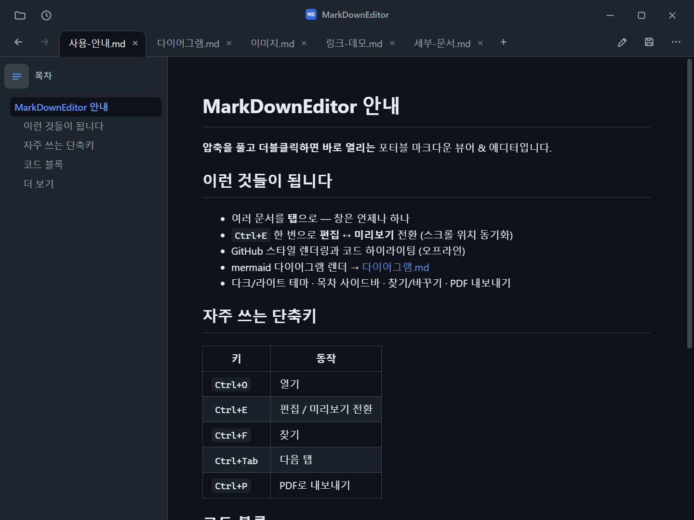
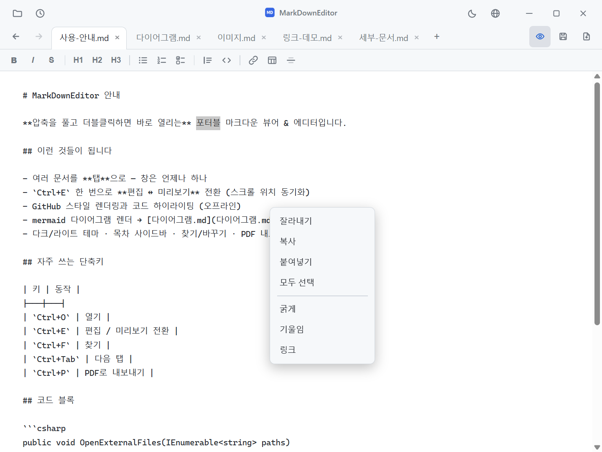
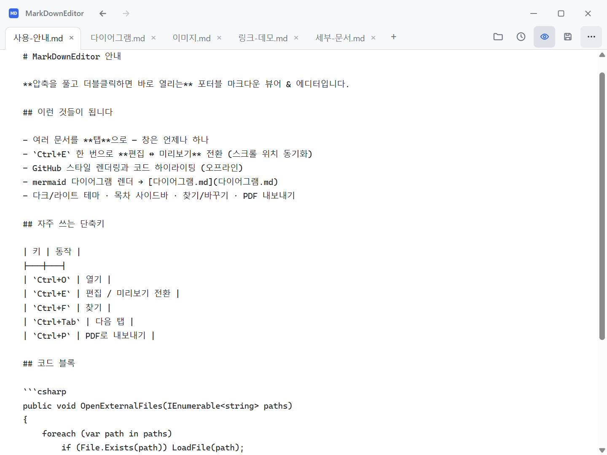
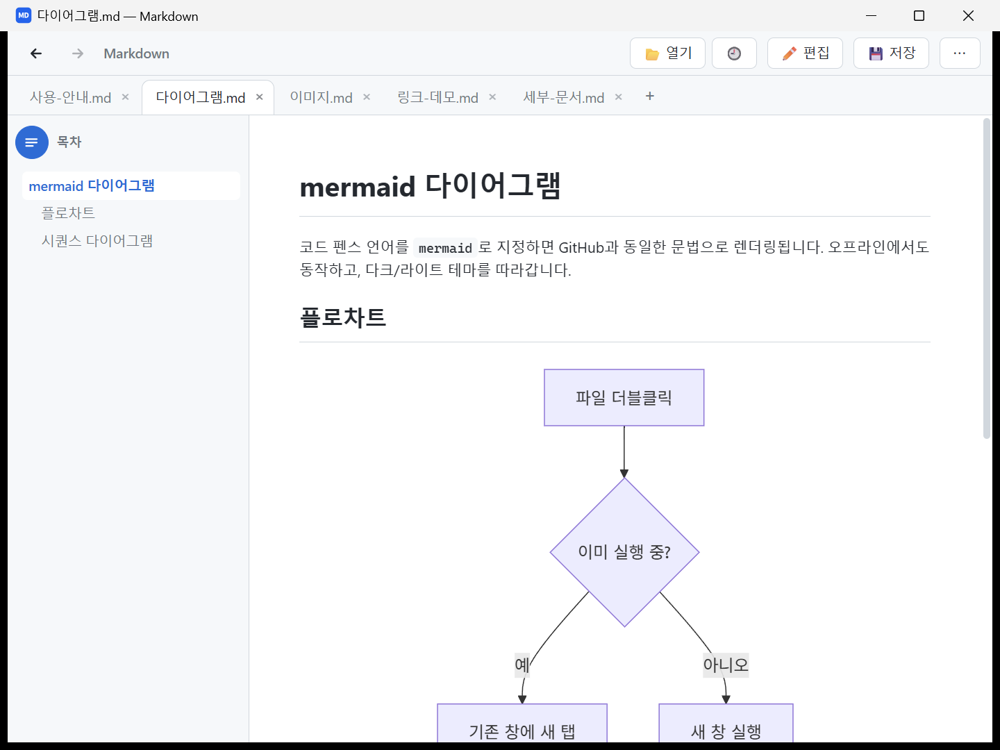
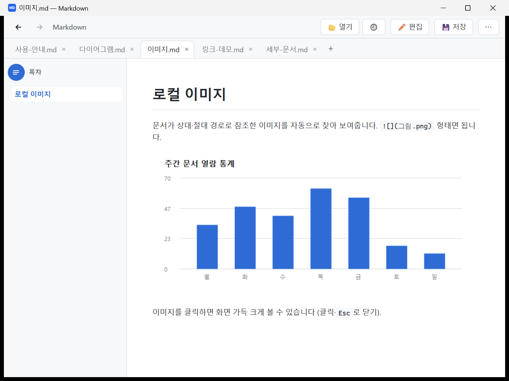
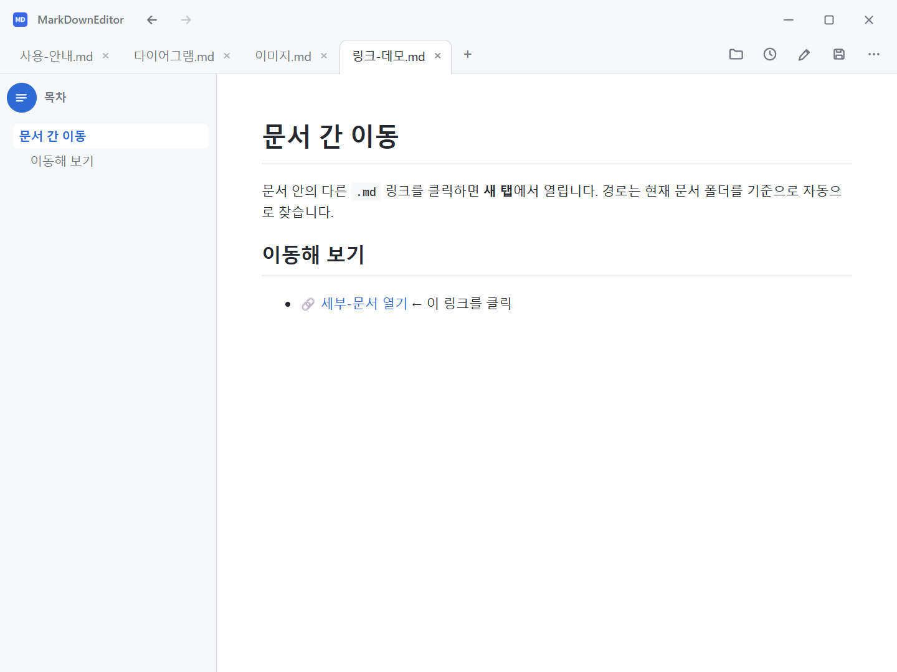
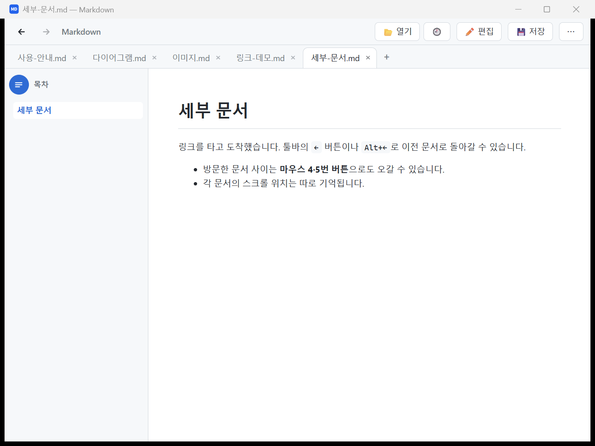
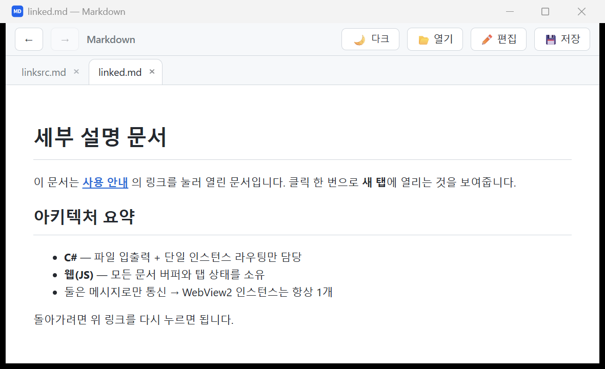
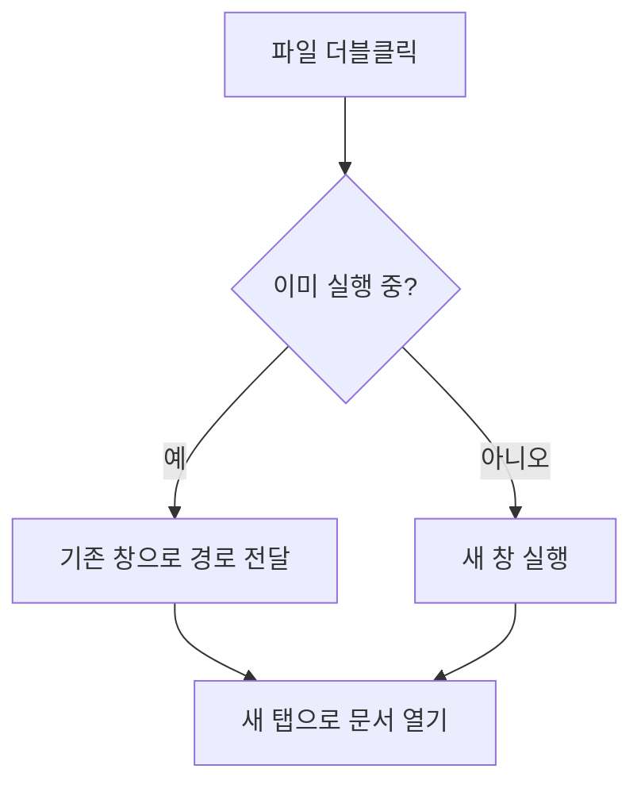
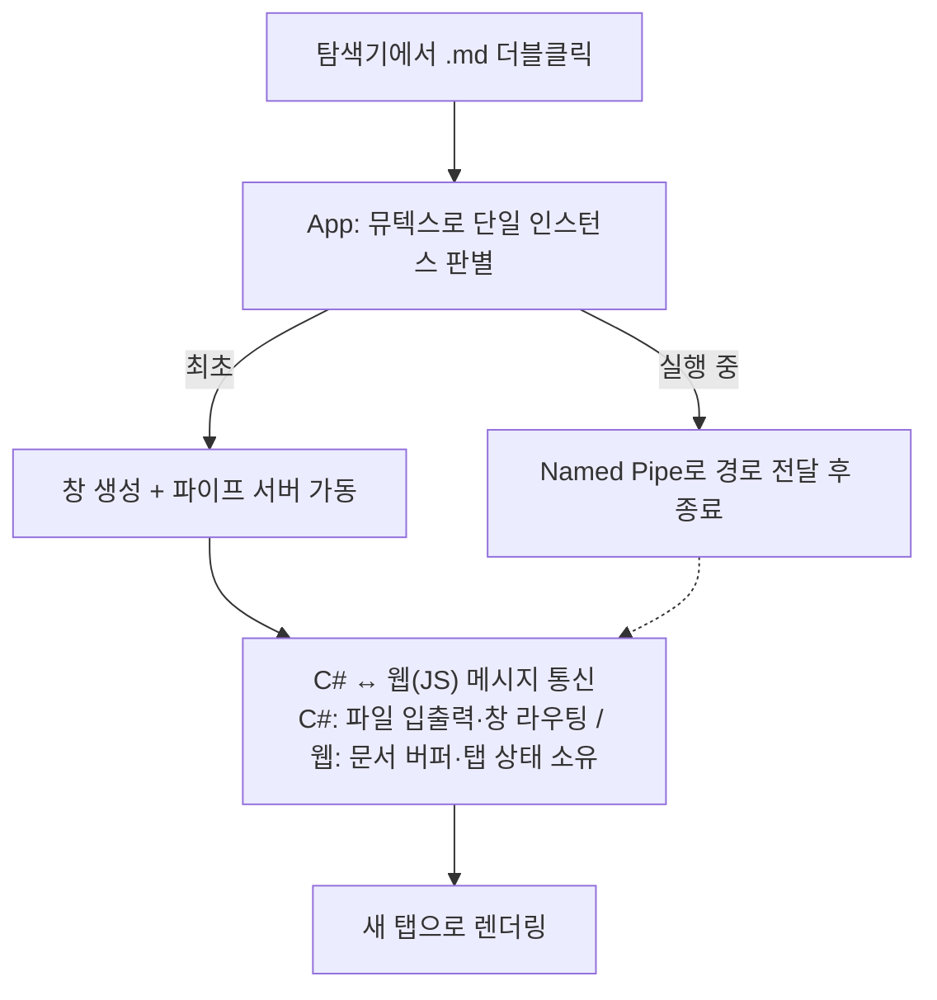

# MarkDownEditor

**가볍고 빠른 Windows용 마크다운 뷰어 & 에디터.**
`.md` 파일을 더블클릭하면 바로 열리는, 설치가 필요 없는 포터블 앱입니다.

[](LICENSE)


[](https://github.com/jjw1270/MarkdownEditor/releases)
[](https://github.com/jjw1270/MarkdownEditor/releases)

**한국어** · [English](README.md) · [日本語](README.ja.md) · [简体中文](README.zh-CN.md) · [繁體中文](README.zh-TW.md) · [Español](README.es.md) · [Français](README.fr.md) · [Deutsch](README.de.md) · [Русский](README.ru.md) · [Português (Brasil)](README.pt-BR.md)

### ⬇️ [Windows용 내려받기](https://github.com/jjw1270/MarkdownEditor/releases/latest/download/MarkDownEditor-standalone.zip) &nbsp;·&nbsp; <sub>.zip, 약 331 MB · 압축 풀고 바로 실행 · [바뀐 점 보기](https://github.com/jjw1270/MarkdownEditor/releases/latest)</sub>


---

## 왜 만들었나

윈도우에서 `.md` 파일을 열려면 대개 설치형 프로그램을 깔거나, 브라우저 확장을 붙이거나, VS Code 같은 코드 에디터를 띄워야 합니다. 이 앱은 그 셋 다 필요 없습니다. **마크다운 뷰어가 먼저**이고, `.md` 기본 프로그램으로 지정해두면 README·명세서·메모 폴더를 탐색기에서 더블클릭하는 것만으로 렌더링된 문서를 볼 수 있습니다. 편집은 `Ctrl+E` 한 번 거리에 있습니다.

- **설치 없음** — 압축만 풀면 끝. USB에 담아 다녀도 됩니다.
- **흔적 없음** — 설정·캐시가 레지스트리나 `%AppData%`가 아니라 실행 파일 옆에만 남습니다.
- **오프라인 문서 처리** — 렌더링·하이라이팅·다이어그램은 전부 로컬입니다. 새 버전 확인을 위해 GitHub Releases를 익명으로 조회하고, 사용자가 업데이트를 실행한 경우에만 릴리즈 파일을 내려받습니다.
- **무료 · 오픈소스** — MIT 라이선스.

**무료 마크다운 뷰어**, **가벼운 Typora 대안**, **md 파일 여는 프로그램**을 찾고 있었다면 바로 그 용도로 만든 앱입니다.

---

## ✨ 이런 앱입니다

- **더블클릭 = 바로 열림** — Windows 기본 `.md` 연결 프로그램으로 지정해두면 탐색기에서 파일을 더블클릭하는 순간 열립니다.
- **창은 언제나 하나, 문서는 탭으로** — 여러 파일을 한꺼번에 열어도 프로그램이 우수수 뜨지 않습니다. 모두 한 창의 **탭**으로 모입니다. 탭은 **드래그로 순서 변경**이 됩니다.
- **드래그&드롭으로 열기** — 탐색기에서 `.md`/`.txt` 파일을 창에 끌어다 놓으면 바로 탭으로 열립니다.
- **모든 링크가 동작** — `.md`는 새 탭, 웹 링크는 기본 브라우저, `.html`은 브라우저, 폴더는 탐색기, `pdf/docx/xlsx/hwp` 등 문서는 연결 프로그램으로 열립니다. `문서.md#섹션` 형태의 **문서 간 앵커 이동**도 지원합니다.
- **뒤로 / 앞으로** — 방문한 문서 사이를 툴바 `←` `→` 버튼, `Alt+←` / `Alt+→`, 또는 **마우스 4·5번 버튼**으로 오갑니다.
- **목차 사이드바** — 탭 바로 아래 왼쪽의 `☰` 버튼으로 헤딩 목록을 켜고 끕니다(상태 기억). 목차가 열리면 버튼이 **패널 상단으로 들어가** 그 자리에서 닫을 수 있습니다. 항목을 누르면 해당 위치로 스크롤되고, **읽는 위치를 따라 현재 섹션이 강조**됩니다.
- **외부 변경 자동 반영** — 열린 문서를 다른 프로그램(IDE·메모장 등)이 저장하면 **자동으로 새로고침**됩니다. 저장 안 한 내 편집이 있으면 덮어쓸지 물어봅니다.
- **편집 ↔ 미리보기 스크롤 동기화** — 모드를 전환하면 보던 위치에 해당하는 지점으로 자동 이동합니다.
- **키보드로 바로 읽기** — 실행 직후 클릭 없이 `PageUp/Down` · 방향키 · `Home/End`로 미리보기를 스크롤할 수 있습니다.
- **탭 우클릭 메뉴** — 닫기 · 다른 탭 모두 닫기 · 탐색기에서 보기 · 경로 복사.
- **코드 하이라이팅** — ` ```cs `, ` ```bash ` 처럼 언어를 지정한 코드 블록에 문법 색상이 입혀집니다(오프라인 동작, 테마 연동).
- **mermaid 다이어그램** — GitHub/GitLab과 동일한 ` ```mermaid ` 문법으로 플로차트·시퀀스 등 렌더링(오프라인 동작, 테마 연동).
- **PDF 내보내기** — 저장 옆 `📄` 버튼 한 번으로 미리보기를 그대로 PDF 파일로 저장합니다.
- **로컬 이미지 표시** — 문서가 상대·절대 경로로 참조한 이미지(``)를 자동으로 찾아 보여줍니다.
- **클립보드 이미지 붙여넣기** — 편집 중 `Ctrl+V`로 스크린샷을 붙여넣으면 문서 옆 `images/` 폴더에 저장되고 링크가 자동 삽입됩니다.
- **자동 백업 & 복구** — 저장 안 된 변경사항을 30초마다 스냅샷해 두었다가, 비정상 종료 후 재실행하면 복구를 제안합니다.
- **세션 복원 & 최근 문서** — 파일 없이 실행하면 마지막에 열려 있던 탭들을 다시 열고, `🕘` 버튼으로 최근 문서를 바로 열 수 있습니다.
- **UI 언어 10종** — 한국어·English·日本語·简体中文·繁體中文·Español·Français·Deutsch·Русский·Português. 기본은 OS 언어를 따르고, 타이틀바 `🌐` 버튼에서 바로 바꿀 수 있습니다.
- **줌 기억** — `Ctrl+휠`로 조절한 배율을 다음 실행에도 유지합니다.
- **위치 기억** — 탭을 전환해도 미리보기 스크롤과 **편집 커서 위치까지** 그대로 유지됩니다.
- **한글 인코딩 자동 감지** — UTF-8은 물론 BOM 없는 CP949(EUC-KR) 문서도 깨짐 없이 열립니다.
- **다크 / 라이트 테마** — 타이틀바 `🌙`/`☀` 버튼으로 전환, 한 번 고르면 다음 실행에도 기억합니다. Windows **제목표시줄도 함께** 전환됩니다.
- **편집 ↔ 미리보기 즉시 전환** — `Ctrl+E` 한 번.
- **서식 바** — 편집 모드에 나타나는 버튼 줄로 굵게·제목·목록·체크박스·인용·코드·링크·표·구분선을 클릭 한 번에. **마크다운 문법을 몰라도 됩니다** (모두 `Ctrl+Z`로 되돌리기 가능).
- **우클릭 메뉴** — 미리보기(복사·링크 열기·주소 복사·이미지 확대·찾기), 편집기(잘라내기·복사·붙여넣기·모두 선택)를 우클릭으로.
- **찾기 / 바꾸기** — `Ctrl+F` 찾기는 **미리보기·편집 모두** 지원(미리보기는 전체 매치 하이라이트), `Ctrl+H` 바꾸기는 편집 모드에서. 대소문자 구분과 **모두 바꾸기**를 지원합니다.
- **이미지 클릭 확대** — 미리보기의 이미지를 클릭하면 화면 가득 크게 보여줍니다(클릭·`Esc`로 닫기).
- **자동 업데이트** — 새 버전이 나오면 타이틀 옆 버전 표시 오른쪽에 **빨간 점**이 떠서 알려줍니다. 버전을 눌러 메뉴 맨 위의 **"새 버전 사용 가능"** → **"업데이트하기"** 한 번이면 앱 안에서 내려받아(진행률 표시) 재시작하며 적용됩니다. 설정·세션은 그대로 유지됩니다.
- **완전 포터블** — 압축만 풀면 끝. WebView2 런타임을 **번들**로 포함해 별도 설치가 필요 없고, 설정·캐시도 실행 파일 옆 폴더에만 남아 **시스템에 흔적을 남기지 않습니다.**

---

## 📸 화면

### 미리보기 (라이트 / 다크)

GitHub 스타일로 제목·표·코드·인용문을 렌더링합니다. 테마는 타이틀바 `🌙`/`☀` 버튼으로 전환합니다.

| 라이트 | 다크 |
|:---:|:---:|
|  |  |

### 언어 설정 — 🌐 메뉴

타이틀바 우측에 테마(`🌙`/`☀`)·언어(`🌐`) 버튼이 있습니다. `🌐` 메뉴에서 **UI 언어(10개 언어)**를 고를 수 있습니다. 버전은 타이틀 텍스트 오른쪽에 표시되며, 클릭하면 업데이트 확인·저장소·버그 신고·기능 제안 메뉴가 열립니다(새 버전이 있으면 버전 오른쪽에 빨간 점). 창은 메모장처럼 **탭·도구가 타이틀바에 통합된 컴팩트 UI**입니다.


### 편집 모드

툴바의 `✏️` 버튼(또는 `Ctrl+E`)을 누르면 원본 마크다운을 직접 고칠 수 있습니다. 같은 자리의 `👁` 버튼으로 되돌리면 즉시 렌더링됩니다.

편집 모드에서는 **서식 바**가 나타납니다 — 굵게/기울임/취소선, 제목(H1~H3), 목록(글머리·번호·체크박스), 인용/코드, 링크/표/구분선을 버튼으로 바로 넣을 수 있어 마크다운 문법을 몰라도 문서를 꾸밀 수 있습니다. 우클릭 메뉴에서는 잘라내기·복사·붙여넣기·모두 선택을 쓸 수 있습니다.





### 탭 + 다이어그램

여러 문서가 상단 탭으로 모입니다. `mermaid` 코드 블록은 다이어그램으로 렌더링됩니다.



### 로컬 이미지

문서와 같은 폴더(또는 상대·절대 경로)의 이미지도 자동으로 찾아 표시합니다. `` 형태면 됩니다.



### 연결된 문서로 이동

문서 안의 `.md` 링크를 클릭하면(왼쪽) 곧바로 **새 탭**에서 열립니다(오른쪽). 경로는 현재 문서가 있는 폴더를 기준으로 자동으로 찾습니다.

| 링크 클릭 전 | 클릭 후 (새 탭) |
|:---:|:---:|
|  |  |

이동한 뒤에는 툴바 왼쪽의 `←`(뒤로) · `→`(앞으로) 버튼, `Alt+←` / `Alt+→`, 또는 마우스 4·5번 버튼으로 방문한 문서 사이를 오갈 수 있습니다. 이동할 곳이 없으면 버튼이 자동으로 비활성화됩니다. 각 문서의 **스크롤 위치도 함께 기억**되어, 돌아오면 보던 자리에서 이어 볼 수 있습니다.



---

## 🚀 설치하기

설치 프로그램 없음, 관리자 권한 없음, 사전 설치할 것 없음. 내려받아 압축 풀고 실행하면 끝입니다.

### 1단계 — 내려받기

**⬇️ [MarkDownEditor-standalone.zip](https://github.com/jjw1270/MarkdownEditor/releases/latest/download/MarkDownEditor-standalone.zip)** — 이 링크는 **항상 최신 버전**을 가리킵니다.

| | |
|---|---|
| **용량** | 약 331 MB — WebView2 런타임이 통째로 들어 있어서 따로 설치할 게 없습니다 |
| **요구 사항** | Windows 10 / 11 (64-bit). 그 외에는 없습니다. |
| **더 보기** | [전체 릴리즈 목록](https://github.com/jjw1270/MarkdownEditor/releases) · [이번 버전에서 바뀐 점](https://github.com/jjw1270/MarkdownEditor/releases/latest) · [전체 변경 이력](CHANGELOG.md) |

<details>
<summary><b>터미널이 편하다면</b> — PowerShell 한 블록으로 내려받기 · 압축 해제 · 실행</summary>

```powershell
$dest = "$env:LOCALAPPDATA\Programs\MarkDownEditor"
$zip  = "$env:TEMP\MarkDownEditor-standalone.zip"

Invoke-WebRequest "https://github.com/jjw1270/MarkdownEditor/releases/latest/download/MarkDownEditor-standalone.zip" -OutFile $zip
Expand-Archive $zip -DestinationPath $dest -Force
Remove-Item $zip

Start-Process "$dest\MarkDownEditor.exe"
```

나중에 업데이트할 때 같은 블록을 다시 실행해도 되고, 아래의 **앱 내 자동 업데이트**를 써도 됩니다.

</details>

### 2단계 — 압축 풀고 실행

쓰기 가능한 곳이면 어디든 좋습니다. `C:\Tools\MarkDownEditor`, 바탕화면, USB 메모리 — 상관없습니다. 압축을 푼 뒤 **`MarkDownEditor.exe`** 를 실행하세요.

폴더 안에는 `MarkDownEditor.exe` 와 함께 `web/`(UI), `Runtime/`(번들 WebView2), `WebView2Data/`(캐시)가 들어 있습니다. 이 폴더를 통째로 옮기거나 복사하거나 USB에 담아 다른 PC에서 그대로 써도 됩니다.

> **처음 실행할 때 뜨는 파란 SmartScreen 창은 정상입니다.** 코드 서명이 없는 실행 파일이라 Windows가 *"Windows의 PC 보호"* 경고를 띄웁니다. **추가 정보 → 실행**을 누르세요. 한 번만 뜹니다.
> 서명 없는 파일을 실행하기 꺼려진다면 직접 빌드해도 됩니다 — 아래 *개발자용* 절차로 명령 두 줄이면 됩니다.

### 3단계 — `.md` 기본 프로그램으로 지정 *(사실상 이게 핵심)*

한 번만 지정해두면, 탐색기에서 마크다운 파일을 더블클릭하는 순간 렌더링된 문서가 바로 뜹니다.

1. 탐색기에서 아무 `.md` 파일을 **우클릭**
2. **연결 프로그램 → 다른 앱 선택**
3. 목록에서 `MarkDownEditor.exe` 선택 — 목록에 없으면 아래로 스크롤해 **내 PC에서 앱 선택**
4. **항상 이 앱을 사용하여 .md 파일 열기** 체크 → **확인**

`.markdown`, `.txt` 도 같은 방법으로 연결할 수 있습니다.

### 업데이트

이 페이지에 다시 올 필요는 없습니다. 앱이 실행될 때마다 GitHub 릴리즈를 확인해서, 새 버전이 있으면 타이틀바 버전 표시 오른쪽에 **빨간 점**이 뜹니다. 버전을 클릭 → **업데이트하기** 를 누르면 진행률을 보여주며 내려받아 스스로 교체하고 재시작합니다. 설정·열려 있던 탭·세션은 그대로 유지됩니다.

### 삭제

폴더를 지우면 끝입니다. 레지스트리에도, `%AppData%` 에도, **앱 및 기능** 목록에도 아무것도 남기지 않았습니다. (파일 연결을 지정했다면 다음에 `.md` 파일을 열 때 Windows가 새 기본 앱을 물어볼 뿐입니다.)

---

## 📖 기본 사용법

| 하고 싶은 것 | 방법 |
|---|---|
| 파일 열기 | 탐색기에서 더블클릭 · 창으로 드래그&드롭 · 타이틀바 왼쪽 `📂 열기` 버튼 · `Ctrl+O` (**여러 개 동시 선택 가능**) |
| 최근 문서 | 열기 옆 `🕘` 버튼 |
| 새 문서 | 탭 줄 끝의 `+` 버튼 · `Ctrl+N` |
| 여러 파일을 한 창에 | 그냥 여러 개를 열면 자동으로 탭이 됩니다 |
| 탭 전환 / 순서 변경 | 탭 클릭 / 탭을 드래그해 원하는 위치로 |
| 방문한 문서로 뒤로 / 앞으로 | 툴바 `←` `→` · `Alt+←` / `Alt+→` · 마우스 4·5번 버튼 |
| 목차 사이드바 | 탭 아래 왼쪽 `☰` 버튼 (미리보기 전용, 상태 기억) |
| 문서 내 목차(섹션)로 이동 | 미리보기의 `#섹션` 링크 클릭 · 목차 항목 클릭 |
| 탭 닫기 | 탭의 `×` · `Ctrl+W` |
| 편집 / 미리보기 전환 | `✏️` 버튼 · `Ctrl+E` |
| 찾기 / 바꾸기 (편집 모드) | `Ctrl+F` 찾기 · `Ctrl+H` 바꾸기 |
| 저장 | `💾 저장` · `Ctrl+S` (새 문서는 저장 위치를 묻습니다) |
| PDF로 내보내기 | 저장 옆 `📄` 버튼 · `Ctrl+P` (미리보기 내용 그대로, 라이트 테마로 출력) |
| 이미지 붙여넣기 | 편집 중 `Ctrl+V` — 문서 옆 `images/` 폴더에 저장 + 링크 삽입 (저장된 문서에서만) |
| 다크/라이트 전환 | 타이틀바 `🌙`/`☀` 버튼 |
| UI 언어 변경 | 타이틀바 `🌐` 버튼 (기본: 시스템 언어 자동, 현재 언어가 툴팁·메뉴에 표시) |
| 업데이트 확인 / 적용 | 타이틀 옆 버전 클릭 → 메뉴 첫 항목 — 새 버전이 있으면 버전 오른쪽에 빨간 점이 뜨고, 팝업의 **업데이트하기**로 바로 적용 |
| 창 이동 / 최대화 | 타이틀바 빈 공간 드래그 / 더블클릭 |
| 연결된 문서 열기 | 미리보기에서 링크 클릭 (`.md`는 탭 · 웹/HTML은 브라우저 · 폴더는 탐색기 · 문서 파일은 연결 프로그램) |

- 저장하지 않은 변경이 있는 탭은 제목 앞에 **●** 표시가 붙고, 닫을 때 확인을 묻습니다.
- 이미 열려 있는 파일을 다시 열면 새 탭을 만들지 않고 **기존 탭으로 이동**합니다.

### 키보드 단축키

| 키 | 동작 |
|------|------|
| `Ctrl+O` | 열기 |
| `Ctrl+N` | 새 문서 탭 |
| `Ctrl+S` | 저장 |
| `Ctrl+P` | PDF로 내보내기 |
| `Ctrl+E` | 편집 / 미리보기 전환 |
| `Ctrl+F` | 찾기 (미리보기·편집 모두) |
| `Ctrl+H` | 찾기 / 바꾸기 |
| `Enter` / `Shift+Enter` | 다음 / 이전 결과 (찾기 입력창에서) |
| `Esc` | 찾기 바 닫기 |
| `Ctrl+B` / `Ctrl+I` | 선택 영역 굵게 / 기울임 (편집 모드, 다시 누르면 해제) |
| `Ctrl+K` | 링크 삽입 (편집 모드 — 주소 자리가 선택된 채 삽입됨) |
| `Tab` / `Shift+Tab` | 들여쓰기 / 내어쓰기 (편집 모드, 여러 줄 선택 지원) |
| `Ctrl+Tab` / `Ctrl+Shift+Tab` | 다음 / 이전 탭 |
| `Ctrl+W` | 현재 탭 닫기 |
| `Alt+←` / `Alt+→` | 문서 뒤로 / 앞으로 이동 |

---

## 🧜 mermaid 다이어그램

코드 펜스 언어를 `mermaid` 로 지정하면 GitHub/GitLab과 **동일한 문법**의 다이어그램이 렌더링됩니다. 플로차트·시퀀스·간트·상태도 등 [mermaid 문법](https://mermaid.js.org/) 전체를 지원하며, **오프라인으로 동작**하고 다크/라이트 테마에 자동으로 맞춰집니다.

````markdown

````

- 이 에디터로 작성한 다이어그램은 GitLab/GitHub 웹에서도 그대로 렌더링됩니다(반대도 마찬가지).
- 문법 오류가 있는 블록은 해당 블록 자리에만 오류가 표시되고 나머지 문서는 정상 렌더링됩니다.

렌더 결과는 위 [탭 + 다이어그램](#탭--다이어그램) 스크린샷을 참고하세요.

---

## 🔒 데이터 & 프라이버시

- 문서·설정을 클라우드로 보내지 않습니다. 모든 동작은 로컬에서만 이뤄집니다.
- 유일한 네트워크 접근은 **자동 업데이트**입니다 — 시작 시(및 수동 확인 시) GitHub API에서 최신 릴리즈 버전만 익명으로 조회하고, 사용자가 직접 업데이트를 실행한 경우에만 릴리즈 파일을 내려받습니다. 문서·개인 정보는 아무것도 전송하지 않습니다.
- WebView2 캐시와 테마·언어 설정은 **실행 파일 옆 `WebView2Data/`, `theme.txt`, `lang.txt`** 에만 저장됩니다. (해당 위치에 쓸 수 없으면 임시 폴더로 자동 폴백)
- 미리보기 안의 인라인 스크립트 실행은 **콘텐츠 보안 정책(CSP)** 으로 차단되어, 문서를 여는 것만으로 코드가 실행되지 않습니다.
- 배포 빌드에서는 브라우저 기본 우클릭 메뉴·개발자 도구가 비활성화되어 있습니다. (앱 자체 우클릭 메뉴는 정상 동작)

---

## 🛠️ 개발자용

### 프로젝트 구조

```
src/
├─ App.xaml(.cs)          # 앱 진입점 + 단일 인스턴스(뮤텍스) + 파일 경로 파이프 라우팅
├─ MainWindow.xaml(.cs)   # WebView2 호스트 + 파일 입출력 + 로딩 스플래시/테마
├─ MainWindow.Update.cs   # 자동 업데이트 (GitHub 릴리즈 확인 · 다운로드 · 재시작 교체)
├─ Loc.cs                 # 네이티브 쪽 UI 문자열 (10개 언어, lang.txt 설정)
├─ app.manifest           # DPI 인식(per-monitor v2), 긴 경로 지원
├─ MarkDownEditor.csproj  # net9.0-windows, WebView2 패키지, web/ 복사 규칙
└─ web/                   # UI (WebView2가 로컬 가상 호스트로 로드)
   ├─ index.html          # 레이아웃(툴바 · 탭 · 목차 · 미리보기/편집기)
   ├─ style.css           # 테마 변수 · GitHub 풍 스타일 · 목차/인쇄(PDF) CSS
   ├─ app.js              # 탭 상태 관리 · 렌더링 · 백업/복구 · C# 브리지
   ├─ i18n.js             # 웹 쪽 UI 문자열 (10개 언어)
   ├─ marked.min.js       # 마크다운 파서
   ├─ highlight.min.js    # 코드 하이라이팅 (오프라인 번들)
   └─ mermaid.min.js      # mermaid 다이어그램 (오프라인 번들)
```

### 빌드

```powershell
cd src
dotnet build -c Release
```

### 포터블 단일 실행 파일로 배포

```powershell
cd src
dotnet publish -c Release -r win-x64 --self-contained true `
  -p:PublishSingleFile=true -p:IncludeNativeLibrariesForSelfExtract=true
```

산출물은 `src/bin/Release/net9.0-windows/win-x64/publish/` 의 `MarkDownEditor.exe` + `web/` 입니다
(`web/`은 exe 옆 폴더로 그대로 로드되므로 단일 파일 번들에 넣지 않습니다).
완전 독립 실행을 위해 여기에 번들 WebView2를 담은 `Runtime/` 폴더만 더해 압축하면 배포본이 됩니다.

### 아키텍처 한눈에



- **C# 쪽**은 파일 읽기/쓰기와 "어느 인스턴스가 파일을 받을지"만 담당합니다.
- **웹 쪽**이 열린 문서 버퍼와 탭 상태를 모두 소유합니다. 덕분에 탭이 몇 개든 **WebView2 인스턴스는 항상 1개**라 가볍습니다.
- 둘은 `postMessage` 기반 메시지로만 통신합니다.

---

## 💬 피드백

버그 신고와 기능 제안은 [GitHub Issues](https://github.com/jjw1270/MarkdownEditor/issues/new/choose)로 받습니다. 앱 안에서 타이틀 옆 버전 표시를 클릭해도 바로 이동할 수 있습니다(버그 신고 폼에는 현재 버전이 자동으로 채워집니다).

## 📄 라이선스

MIT — [LICENSE](LICENSE) 참고. 번들된 서드파티 구성요소는 [THIRD-PARTY-NOTICES.md](THIRD-PARTY-NOTICES.md)에 정리되어 있습니다 (mermaid 번들에는 문서화된 로컬 패치가 하나 포함되어 있습니다).

---

<sub>Made with .NET 9 (WPF) · WebView2 · marked.js</sub>
