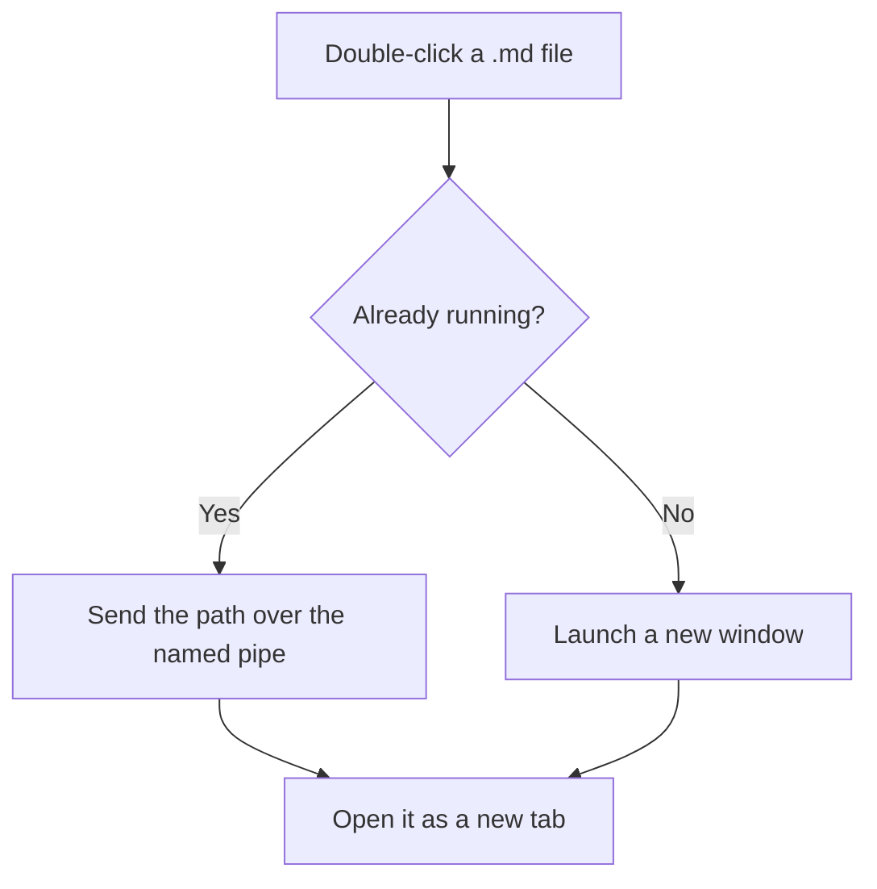
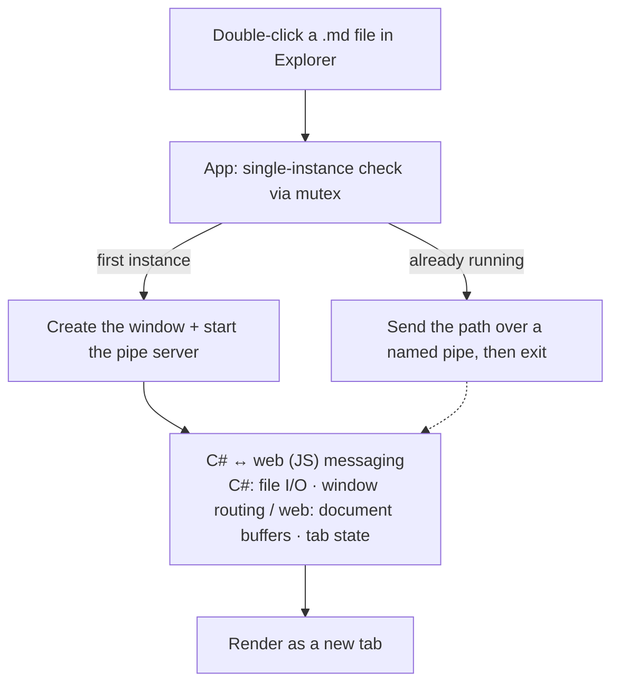

# MarkDownEditor

**A free, portable Markdown viewer and editor for Windows 10 / 11.**
Double-click any `.md` file and it opens instantly — no installer, no setup, no account, no telemetry.

[](LICENSE)


[](https://github.com/jjw1270/MarkdownEditor/releases)
[](https://github.com/jjw1270/MarkdownEditor/releases)

[한국어](README.ko.md) · **English** · [日本語](README.ja.md) · [简体中文](README.zh-CN.md) · [繁體中文](README.zh-TW.md) · [Español](README.es.md) · [Français](README.fr.md) · [Deutsch](README.de.md) · [Русский](README.ru.md) · [Português (Brasil)](README.pt-BR.md)

### ⬇️ [Download for Windows](https://github.com/jjw1270/MarkdownEditor/releases/latest/download/MarkDownEditor-standalone.zip) &nbsp;·&nbsp; <sub>.zip, ~331 MB · unzip and run · [what's new](https://github.com/jjw1270/MarkdownEditor/releases/latest)</sub>


---

## Why this exists

Most Markdown apps on Windows want an installer, a workspace, a vault, or a subscription. This one wants none of them. It is a **Markdown file viewer first** — the app you set as the default handler for `.md`, so that double-clicking a README, a spec, or a folder of notes just shows you the rendered document. Editing is one keystroke away when you need it.

- **No installation** — unzip the folder anywhere, including a USB stick, and run the `.exe`.
- **No traces** — settings and cache live next to the executable, not in the registry or `%AppData%`.
- **Offline document processing** — rendering and editing stay local. The app checks GitHub Releases anonymously for new versions, and downloads a release only when you explicitly start an update.
- **Free and open source** — MIT licensed.

If you have been looking for a lightweight **Typora alternative**, a **free Markdown preview app for Windows**, or simply a way to **open `.md` files without a browser extension or a full code editor**, this is built for exactly that.

---

## ✨ Features

**Reading**

- **Double-click to open** — set it as the default `.md` handler and Explorer does the rest.
- **One window, many tabs** — open twenty files and you get twenty tabs, not twenty windows (single instance via mutex + named pipe). Tabs reorder by drag & drop and cycle with `Ctrl+Tab`.
- **Drag & drop** — drop `.md` / `.txt` files onto the window to open them as tabs.
- **GitHub-style rendering** — headings, tables, task lists, blockquotes, and code, styled to match what you see on GitHub.
- **Syntax highlighting** — fenced blocks with a language tag (` ```cs `, ` ```bash `) get colored. Bundled offline, theme-aware.
- **Mermaid diagrams** — the same ` ```mermaid ` syntax GitHub and GitLab use: flowcharts, sequence, gantt, state. Bundled offline, theme-aware.
- **Table-of-contents sidebar** — toggled with `☰`, with scroll-spy highlighting of the section you are reading.
- **Every link works** — `.md` opens in a new tab, web links in your browser, folders in Explorer, and `pdf` / `docx` / `xlsx` / `hwp` in their default apps. Cross-document anchors (`doc.md#section`) are supported.
- **Back / Forward** — toolbar `←` `→`, `Alt+←` / `Alt+→`, or mouse buttons 4 and 5. Scroll position is remembered per document.
- **Local images** — relative and absolute image paths (``) resolve automatically. Click any image to view it full-screen.
- **Keyboard-first** — scroll with `PageUp` / `PageDown` / arrows / `Home` / `End` the moment the app launches, no click needed.
- **Korean encoding detection** — BOM-less CP949 / EUC-KR files open correctly alongside UTF-8.

**Writing**

- **Edit ↔ Preview in one keystroke** — `Ctrl+E`, with scroll position synchronized between the two modes.
- **Formatting bar** — bold, italic, strikethrough, headings, bullet / numbered / task lists, quote, code, link, table, divider. One click each, all undoable with `Ctrl+Z`. **You do not need to know Markdown syntax.**
- **Find and replace** — `Ctrl+F` works in *both* preview (all matches highlighted) and edit mode; `Ctrl+H` replaces, with case sensitivity and Replace All.
- **Paste screenshots** — `Ctrl+V` an image while editing and it is saved into an `images/` folder next to the document, with the link inserted for you.
- **Export to PDF** — one button, or `Ctrl+P`, turns the rendered preview into a PDF.
- **Auto-reload on external change** — if your IDE or another editor saves the open file, the tab refreshes automatically. Your unsaved edits are never silently overwritten.
- **Auto-backup and crash recovery** — unsaved changes are snapshotted every 30 seconds and offered back to you after an unexpected shutdown.
- **Session restore** — launch without a file and your previous tabs come back. Recent documents are one click away under `🕘`.

**Comfort**

- **Dark and light themes** — including the Windows title bar. Remembered across runs.
- **10 UI languages** — 한국어, English, 日本語, 简体中文, 繁體中文, Español, Français, Deutsch, Русский, Português (Brasil). Follows your OS language by default; switch anytime from `🌐`.
- **Compact chrome** — tabs and tools live in a custom title bar, Notepad-style.
- **Remembers everything** — zoom level (`Ctrl+Wheel`), scroll position, and even the editor caret position, per tab.
- **In-app updates** — a red dot appears next to the version when a new release is out. Click the version → **Update**, and it downloads and restarts itself, keeping your settings and session.

---

## 📸 Screenshots

### Preview — light and dark

| Light | Dark |
|:---:|:---:|
|  |  |

### Tabs and mermaid diagrams


### Edit mode with the formatting bar


### Language and version menu


### Following links between documents

Click a `.md` link (left) and it opens in a new tab (right), resolved relative to the current document.

| Before the click | After — new tab |
|:---:|:---:|
|  |  |


---

## 🚀 Installation

No installer, no administrator rights, no dependencies. Download, unzip, run.

### Step 1 — Download

**⬇️ [MarkDownEditor-standalone.zip](https://github.com/jjw1270/MarkdownEditor/releases/latest/download/MarkDownEditor-standalone.zip)** — this link always points at the newest release.

| | |
|---|---|
| **Size** | ~331 MB — a complete WebView2 runtime is bundled, which is why there is nothing else to install |
| **Requires** | Windows 10 or 11, 64-bit. Nothing else. |
| **More** | [All releases](https://github.com/jjw1270/MarkdownEditor/releases) · [What's new in the latest version](https://github.com/jjw1270/MarkdownEditor/releases/latest) · [Full changelog](CHANGELOG.md) |

<details>
<summary><b>Prefer the terminal?</b> Download, unpack and launch with one PowerShell block</summary>

```powershell
$dest = "$env:LOCALAPPDATA\Programs\MarkDownEditor"
$zip  = "$env:TEMP\MarkDownEditor-standalone.zip"

Invoke-WebRequest "https://github.com/jjw1270/MarkdownEditor/releases/latest/download/MarkDownEditor-standalone.zip" -OutFile $zip
Expand-Archive $zip -DestinationPath $dest -Force
Remove-Item $zip

Start-Process "$dest\MarkDownEditor.exe"
```

To update later, run the same block again — or just use the in-app updater described below.

</details>

### Step 2 — Unzip and run

Extract the folder anywhere you can write to: `C:\Tools\MarkDownEditor`, your Desktop, a USB stick — it does not matter. Then run **`MarkDownEditor.exe`**.

The folder holds `MarkDownEditor.exe` plus `web/` (the UI), `Runtime/` (the bundled WebView2), and `WebView2Data/` (cache). Keep them together and you can move, copy or carry the whole thing anywhere.

> **The blue SmartScreen dialog on first run is expected.** The executable is not code-signed, so Windows shows *"Windows protected your PC"*. Click **More info → Run anyway**. It only appears once.
> If you would rather not run an unsigned binary, building it yourself takes two commands — see *Building from source* below.

### Step 3 — Make it the default app for `.md` files *(this is the point)*

Once this is set, double-clicking any Markdown file in Explorer opens it rendered, instantly.

1. Right-click any `.md` file in Explorer
2. **Open with → Choose another app**
3. Select `MarkDownEditor.exe` — if it is not in the list, scroll down and use **Choose an app on your PC**
4. Tick **Always use this app to open .md files**, then **OK**

The same works for `.markdown` and `.txt` if you want them handled too.

### Updating

You will not need to come back here. On startup the app checks GitHub Releases and puts a **red dot** next to the version number in the title bar when a newer build exists. Click the version → **Update**, and it downloads with a progress bar, replaces itself and restarts — your settings, open tabs and session all survive.

### Uninstalling

Delete the folder. That is the entire procedure — nothing was written to the registry, to `%AppData%`, or to *Add or remove programs*. (If you set the file association, Windows will simply ask you to pick a new default the next time you open a `.md` file.)

---

## ⌨️ Keyboard shortcuts

| Key | Action |
|------|------|
| `Ctrl+O` | Open (multi-select supported) |
| `Ctrl+N` | New document tab |
| `Ctrl+S` | Save |
| `Ctrl+P` | Export as PDF |
| `Ctrl+E` | Toggle edit / preview |
| `Ctrl+F` | Find — works in preview *and* edit mode |
| `Ctrl+H` | Find and replace (edit mode) |
| `Enter` / `Shift+Enter` | Next / previous match |
| `Esc` | Close the find bar |
| `Ctrl+B` / `Ctrl+I` | Bold / italic (edit mode, toggles) |
| `Ctrl+K` | Insert link — the address part is pre-selected |
| `Tab` / `Shift+Tab` | Indent / outdent, multi-line aware |
| `Ctrl+Tab` / `Ctrl+Shift+Tab` | Next / previous tab |
| `Ctrl+W` | Close tab |
| `Alt+←` / `Alt+→` | Back / forward between documents |
| `Ctrl+Wheel` | Zoom (remembered across runs) |

---

## 🧜 Mermaid diagrams

Tag a fenced block `mermaid` and it renders as a diagram — the [full mermaid syntax](https://mermaid.js.org/), offline, matching your current theme.

````markdown

````

Diagrams written here render identically on GitHub and GitLab, and vice versa. A block with a syntax error shows the error in place; the rest of the document still renders.

---

## 🔒 Privacy

- Your documents and settings never leave your machine. All rendering, editing, and exporting is local.
- The **only** network access is the auto-update check: an anonymous request to the GitHub Releases API for the latest version number, plus the release download itself if — and only if — you start an update. No document content, no analytics, no identifiers.
- Theme and language preferences and the WebView2 cache are written next to the executable (`theme.txt`, `lang.txt`, `WebView2Data/`), falling back to a temp folder if that location is read-only.
- Inline scripts inside previewed documents are blocked by a **Content Security Policy**, so opening an untrusted Markdown file cannot execute code.
- Release builds disable the browser context menu and developer tools. (The app's own right-click menus work normally.)

---

## 🛠️ Building from source

```powershell
cd src
dotnet publish -c Release -r win-x64 --self-contained true `
  -p:PublishSingleFile=true -p:IncludeNativeLibrariesForSelfExtract=true
```

Output lands in `src/bin/Release/net9.0-windows/win-x64/publish/` as `MarkDownEditor.exe` plus `web/` — the web folder is loaded from beside the exe, so it stays out of the single-file bundle. Add a WebView2 Fixed Version Runtime as `Runtime/` next to the exe for a fully self-contained build.

### Project layout

```
src/
├─ App.xaml(.cs)          # entry point + single instance (mutex) + file-path pipe routing
├─ MainWindow.xaml(.cs)   # WebView2 host + file I/O + splash / theme
├─ MainWindow.Update.cs   # auto-update (check GitHub Releases · download · restart)
├─ Loc.cs                 # native-side UI strings (10 languages)
├─ app.manifest           # per-monitor v2 DPI awareness, long path support
└─ web/                   # the UI, served to WebView2 from a local virtual host
   ├─ index.html          # layout (toolbar · tabs · TOC · preview/editor)
   ├─ style.css           # theme variables · GitHub-like styling · TOC and print CSS
   ├─ app.js              # tab state · rendering · backup/recovery · C# bridge
   ├─ i18n.js             # web-side UI strings (10 languages)
   ├─ marked.min.js       # Markdown parser
   ├─ highlight.min.js    # code highlighting (bundled offline)
   └─ mermaid.min.js      # mermaid diagrams (bundled offline)
```

### Architecture



The C# (WPF) side owns file I/O, the single-instance pipe, and the window chrome. The web side — vanilla JS in a **single** WebView2 — owns every document buffer and all tab state, which is why the app stays light no matter how many tabs are open. The two talk only through `postMessage`.

A full feature tour is also available in [Korean](README.ko.md).

---

## 💬 Feedback

Bug reports and feature requests are welcome on [GitHub Issues](https://github.com/jjw1270/MarkdownEditor/issues/new/choose). You can also click the version label next to the title inside the app — the bug report form arrives pre-filled with your version.

If the app is useful to you, a ⭐ helps other people find it.

## 📄 License

MIT — see [LICENSE](LICENSE). Bundled third-party components are listed in [THIRD-PARTY-NOTICES.md](THIRD-PARTY-NOTICES.md) (the mermaid bundle carries one small local patch, documented there).

---

<sub>Made with .NET 9 (WPF) · WebView2 · marked.js · highlight.js · mermaid</sub>
