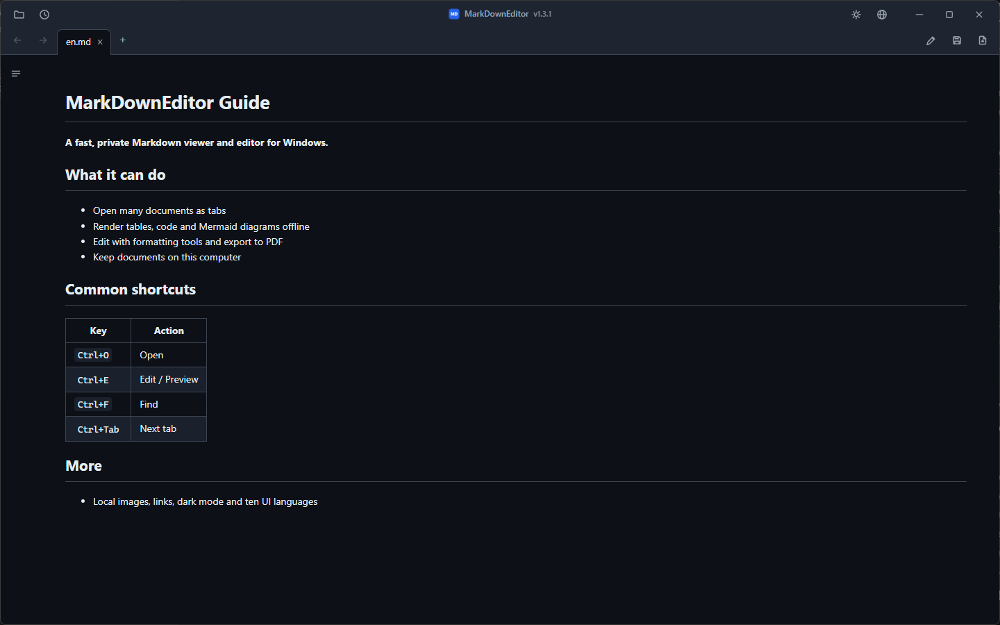
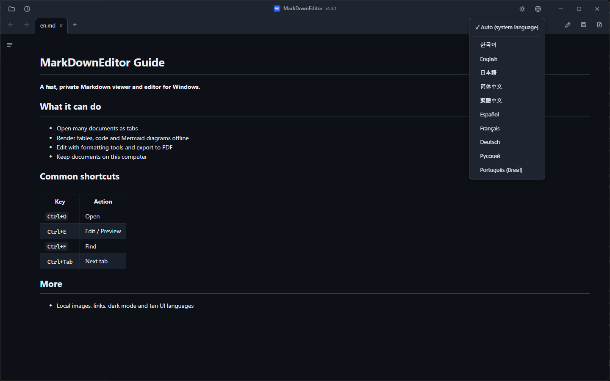
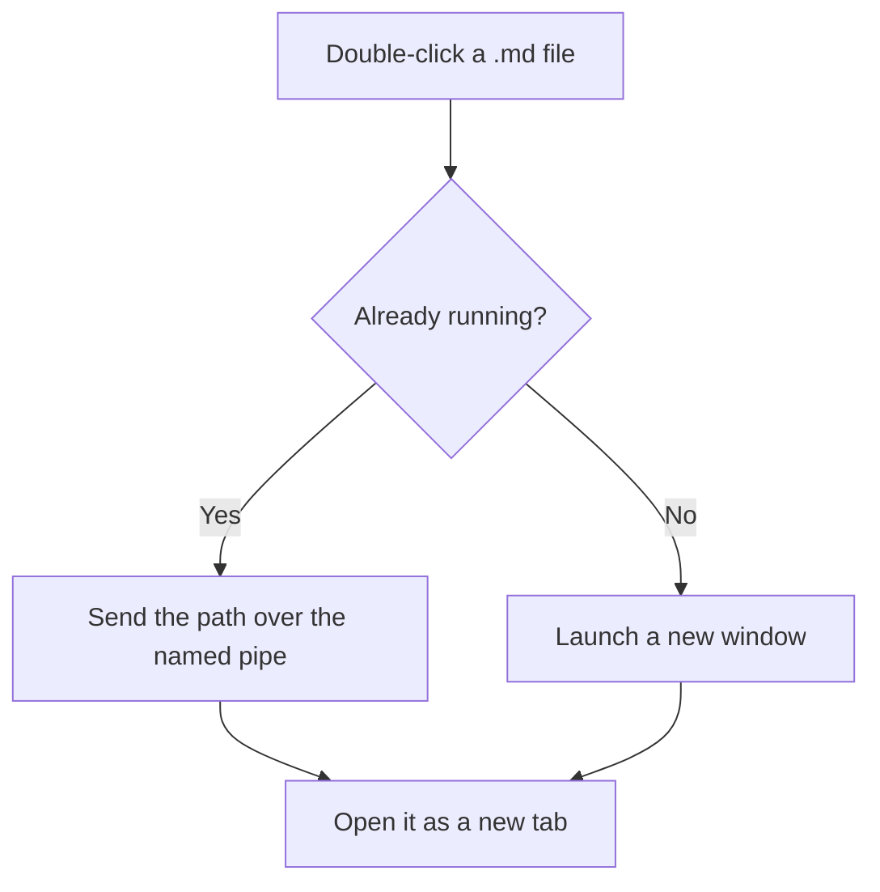
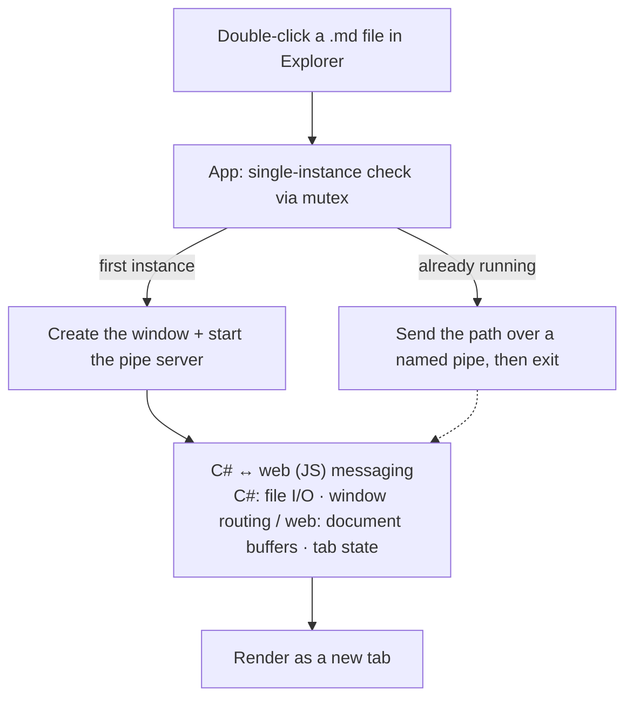

# MarkDownEditor

MarkDownEditor is a Markdown viewer and editor for Windows 10 and 11. Set it as the default app for `.md` files and they open in a rendered view from Explorer. It is available as an installer or a portable ZIP and does not require an account or collect telemetry.

[](LICENSE)


[](https://github.com/jjw1270/MarkdownEditor/releases)
[](https://github.com/jjw1270/MarkdownEditor/releases)

[한국어](README.ko.md) · **English** · [日本語](README.ja.md) · [简体中文](README.zh-CN.md) · [繁體中文](README.zh-TW.md) · [Español](README.es.md) · [Français](README.fr.md) · [Deutsch](README.de.md) · [Русский](README.ru.md) · [Português (Brasil)](README.pt-BR.md)

### [Windows installer](https://github.com/jjw1270/MarkdownEditor/releases/latest/download/MarkDownEditor-Setup-x64.exe) &nbsp;·&nbsp; [Portable ZIP](https://github.com/jjw1270/MarkdownEditor/releases/latest/download/MarkDownEditor-standalone.zip) &nbsp;·&nbsp; <sub>[what's new](https://github.com/jjw1270/MarkdownEditor/releases/latest)</sub>



---

## Why this exists

I built MarkDownEditor because opening a Markdown file on Windows often meant starting a full code editor or using a browser extension. This app is meant to behave more like Notepad: double-click a file to read it, then press `Ctrl+E` if you need to edit it.

- The installer adds Start menu and Open With entries for the current user.
- The portable package keeps its settings and cache beside the executable when that folder is writable. It falls back to `%TEMP%\MarkDownEditor` for read-only locations.
- Rendering and editing happen locally. The only routine network request is an anonymous check for new GitHub releases.
- The project is released under the MIT license.

---

## Features

**Reading**

- **Double-click to open** — set it as the default `.md` handler and Explorer does the rest.
- **One window, many tabs** — open twenty files and you get twenty tabs, not twenty windows (single instance via mutex + named pipe). Tabs reorder by drag & drop and cycle with `Ctrl+Tab`.
- **Drag & drop** — drop `.md` / `.txt` files onto the window to open them as tabs.
- **GitHub-style rendering** — headings, tables, task lists, blockquotes, and code, styled to match what you see on GitHub.
- **Syntax highlighting** — fenced blocks with a language tag (` ```cs `, ` ```bash `) get colored. Bundled offline, theme-aware.
- **Mermaid diagrams** — the same ` ```mermaid ` syntax GitHub and GitLab use: flowcharts, sequence, gantt, state. Bundled offline, theme-aware.
- **Table-of-contents sidebar** — toggled with `☰`, with scroll-spy highlighting of the section you are reading.
- **Document links** — `.md` opens in a new tab, web links in your browser, folders in Explorer, and `pdf` / `docx` / `xlsx` / `hwp` in their default apps. Cross-document anchors (`doc.md#section`) are supported.
- **Back / Forward** — toolbar `←` `→`, `Alt+←` / `Alt+→`, or mouse buttons 4 and 5. Scroll position is remembered per document.
- **Local images** — relative and absolute image paths (``) resolve automatically. Click any image to view it full-screen.
- **Keyboard-first** — scroll with `PageUp` / `PageDown` / arrows / `Home` / `End` the moment the app launches, no click needed.
- **Korean encoding detection** — BOM-less CP949 / EUC-KR files open correctly alongside UTF-8.

**Writing**

- **Edit ↔ Preview in one keystroke** — `Ctrl+E`, with scroll position synchronized between the two modes.
- **Formatting bar** — buttons for bold, italic, strikethrough, headings, lists, quotes, code, links, tables, and dividers. Changes remain undoable with `Ctrl+Z`.
- **Find and replace** — `Ctrl+F` works in *both* preview (all matches highlighted) and edit mode; `Ctrl+H` replaces, with case sensitivity and Replace All.
- **Paste screenshots** — `Ctrl+V` an image while editing and it is saved into an `images/` folder next to the document, with the link inserted for you.
- **Export to PDF** — one button, or `Ctrl+P`, turns the rendered preview into a PDF.
- **Auto-reload on external change** — if your IDE or another editor saves the open file, the tab refreshes automatically. Your unsaved edits are never silently overwritten.
- **Auto-backup and crash recovery** — unsaved changes are snapshotted every 30 seconds and offered back to you after an unexpected shutdown.
- **Session restore** — launch without a file and your previous tabs come back. Recent documents are one click away under `🕘`.

**Comfort**

- **Dark and light themes** — including the Windows title bar. Remembered across runs.
- **10 UI languages** — 한국어, English, 日本語, 简体中文, 繁體中文, Español, Français, Deutsch, Русский, Português (Brasil). Follows your OS language by default; switch anytime from `🌐`.
- **Compact chrome** — tabs and tools live in a custom title bar, Notepad-style.
- **Per-tab state** — zoom level (`Ctrl+Wheel`), scroll position, and editor caret position are restored when you switch tabs.
- **In-app updates** — a red dot appears next to the version when a new release is out. Portable installs atomically replace their ZIP payload; installed copies run the verified next installer so Windows' uninstall metadata stays correct.

---

## Screenshots

| Document preview | Language and version menu |
|:---:|:---:|
|  |  |

---

## Installation

Both packages are for Windows 10 version 1809 or newer / Windows 11, x64. Neither requires administrator rights.

| Package | Best for | Approximate download | Runtime and data |
|---|---|---:|---|
| **[Windows installer](https://github.com/jjw1270/MarkdownEditor/releases/latest/download/MarkDownEditor-Setup-x64.exe)** | Normal daily use | 45 MB | Installs per-user, uses automatically serviced Evergreen WebView2, adds Start menu and Open With entries. Data is under `%LOCALAPPDATA%\MarkDownEditor`. Internet is needed only if WebView2 is not installed; Setup fails clearly if the prerequisite cannot be installed. |
| **[Portable ZIP](https://github.com/jjw1270/MarkdownEditor/releases/latest/download/MarkDownEditor-standalone.zip)** | USB, offline and no-install use | 325 MB | Includes a fixed WebView2 runtime. Data stays in `WebView2Data/` beside the app when writable. |

[All releases](https://github.com/jjw1270/MarkdownEditor/releases) · [Latest release notes](https://github.com/jjw1270/MarkdownEditor/releases/latest) · [Full changelog](CHANGELOG.md)

<details>
<summary><b>Prefer the terminal?</b> Download, unpack and launch with one PowerShell block</summary>

```powershell
$dest = "$env:LOCALAPPDATA\Programs\MarkDownEditor-Portable"
$zip  = "$env:TEMP\MarkDownEditor-standalone.zip"

Invoke-WebRequest "https://github.com/jjw1270/MarkdownEditor/releases/latest/download/MarkDownEditor-standalone.zip" -OutFile $zip
Expand-Archive $zip -DestinationPath $dest -Force
Remove-Item $zip

Start-Process "$dest\MarkDownEditor.exe"
```

To update later, run the same block again — or just use the in-app updater described below.

</details>

### Portable setup

Extract the folder anywhere you can write to: `C:\Tools\MarkDownEditor`, your Desktop, a USB stick — it does not matter. Then run **`MarkDownEditor.exe`**.

The folder holds `MarkDownEditor.exe` plus `web/` (the UI), `Runtime/` (the bundled WebView2), and `WebView2Data/` (cache). Keep them together and you can move, copy or carry the whole thing anywhere.

> **The blue SmartScreen dialog on first run is expected.** The executable is not code-signed, so Windows shows *"Windows protected your PC"*. Click **More info → Run anyway**. It only appears once.
> If you would rather not run an unsigned binary, building it yourself takes two commands — see *Building from source* below.

### Make it the default app for `.md` files

Once this is set, double-clicking any Markdown file in Explorer opens it rendered, instantly.

1. Right-click any `.md` file in Explorer
2. **Open with → Choose another app**
3. Select **MarkDownEditor** — the installer registers it automatically; for the portable package, use **Choose an app on your PC** and select `MarkDownEditor.exe`
4. Tick **Always use this app to open .md files**, then **OK**

The same works for `.markdown` and `.txt` if you want them handled too.

### Updating

On startup the app anonymously checks GitHub Releases and puts a **red dot** next to the version when a newer build exists. Click the version → **Update**. The selected asset's URL, size, SHA-256 digest, structure and version are verified before the app closes. Portable copies replace their payload atomically; installed copies run the next per-user installer. Settings and session data are preserved.

### Uninstalling

- **Installed edition:** use **Settings → Apps → Installed apps → MarkDownEditor → Uninstall**. Program files, shortcuts and MarkDownEditor's own Open With registrations are removed; user data under `%LOCALAPPDATA%\MarkDownEditor` is preserved for safe reinstall or can be deleted manually.
- **Portable edition:** delete its folder. If it ever ran from a read-only location, also remove `%TEMP%\MarkDownEditor` to erase fallback settings and cache.

---

## Keyboard shortcuts

| Key | Action |
|------|------|
| `Ctrl+O` | Open (multi-select supported) |
| `Ctrl+N` | New document tab |
| `Ctrl+S` | Save |
| `Ctrl+P` | Export as PDF |
| `Ctrl+E` | Toggle edit / preview |
| `Ctrl+F` | Find — works in preview *and* edit mode |
| `Ctrl+H` | Find and replace (edit mode) |
| `Enter` / `Shift+Enter` | Next / previous match |
| `Esc` | Close the find bar |
| `Ctrl+B` / `Ctrl+I` | Bold / italic (edit mode, toggles) |
| `Ctrl+K` | Insert link — the address part is pre-selected |
| `Tab` / `Shift+Tab` | Indent / outdent, multi-line aware |
| `Ctrl+Tab` / `Ctrl+Shift+Tab` | Next / previous tab |
| `Ctrl+W` | Close tab |
| `Alt+←` / `Alt+→` | Back / forward between documents |
| `Ctrl+Wheel` | Zoom (remembered across runs) |

---

## Mermaid diagrams

Tag a fenced block `mermaid` and the bundled renderer displays it offline using the current theme. See the [Mermaid documentation](https://mermaid.js.org/) for supported syntax.

````markdown

````

The fenced-block format is also understood by GitHub and GitLab. A syntax error is shown in that block without stopping the rest of the document from rendering.

---

## Privacy

- Your documents and settings never leave your machine. All rendering, editing, and exporting is local.
- During app use, network access is limited to the auto-update check: an anonymous GitHub Releases request and a release download only when you start an update. On first installation, Setup may also download Microsoft's WebView2 Runtime if Windows does not already have it. No document content, analytics, or identifiers are sent.
- The installed edition stores theme and language preferences, session recovery data, recent-document paths, and WebView2 cache under `%LOCALAPPDATA%\MarkDownEditor`. The portable edition stores them in `WebView2Data/` beside the executable, with `%TEMP%\MarkDownEditor` as a read-only fallback.
- Previewed HTML is stripped of scripts, frames, forms, event handlers, and document-wide styles. A **Content Security Policy** also blocks plugins, base-URL rewriting, form submission, frames, and automatic remote-image requests. Local images are resolved by the native host and rendered as local data.
- Release builds disable the browser context menu and developer tools. (The app's own right-click menus work normally.)

---

## Building from source

```powershell
.\tests\RepositoryContracts.ps1
.\scripts\build-release.ps1 -RuntimeSource C:\path\to\WebView2FixedRuntime
```

The repository pins .NET SDK 10.0.302 and Inno Setup 7.0.2. The release script publishes one self-contained app, creates both distributions, verifies the pinned WebView2 bootstrapper, and writes SHA-256 sums plus a machine-readable manifest. See [DESIGN.md](DESIGN.md) for distribution and trust boundaries.

The current end-to-end release evidence is recorded in [QA_REPORT_2026-07-29.md](QA_REPORT_2026-07-29.md).

### Project layout

```
src/
├─ App.xaml(.cs)          # entry point + single instance (mutex) + file-path pipe routing
├─ MainWindow.xaml(.cs)   # WebView2 host + file I/O + splash / theme
├─ MainWindow.Update.cs   # auto-update (check GitHub Releases · download · restart)
├─ Loc.cs                 # native-side UI strings (10 languages)
├─ app.manifest           # per-monitor v2 DPI awareness, long path support
└─ web/                   # the UI, served to WebView2 from a local virtual host
   ├─ index.html          # layout (toolbar · tabs · TOC · preview/editor)
   ├─ style.css           # theme variables · GitHub-like styling · TOC and print CSS
   ├─ app.js              # tab state · rendering · backup/recovery · C# bridge
   ├─ i18n.js             # web-side UI strings (10 languages)
   ├─ marked.min.js       # Markdown parser
   ├─ highlight.min.js    # code highlighting (bundled offline)
   └─ mermaid.min.js      # mermaid diagrams (bundled offline)
```

### Architecture



The C# (WPF) side owns file I/O, the single-instance pipe, and the window chrome. The web side — vanilla JS in a **single** WebView2 — owns every document buffer and all tab state, which is why the app stays light no matter how many tabs are open. The two talk only through `postMessage`.

A full feature tour is also available in [Korean](README.ko.md).

---

## Feedback

Bug reports and feature requests are welcome on [GitHub Issues](https://github.com/jjw1270/MarkdownEditor/issues/new/choose). You can also click the version label next to the title inside the app — the bug report form arrives pre-filled with your version.

## License

MIT — see [LICENSE](LICENSE). Bundled third-party components are listed in [THIRD-PARTY-NOTICES.md](THIRD-PARTY-NOTICES.md) (the mermaid bundle carries one small local patch, documented there).

---

<sub>Made with .NET 10 (WPF) · WebView2 · marked.js · highlight.js · mermaid</sub>
