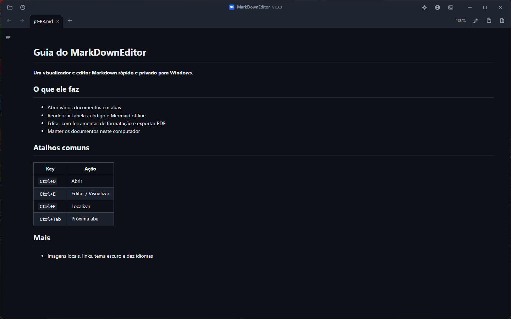
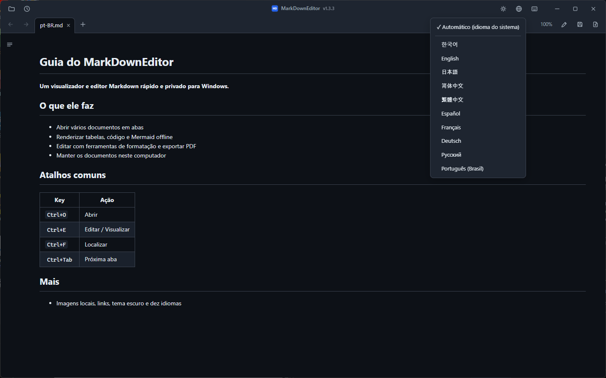

# MarkDownEditor

MarkDownEditor é um visualizador e editor de Markdown para Windows 10 e 11. Ele está disponível como instalador ou ZIP portátil e não usa conta nem telemetria.

[한국어](README.ko.md) · [English](README.md) · [日本語](README.ja.md) · [简体中文](README.zh-CN.md) · [繁體中文](README.zh-TW.md) · [Español](README.es.md) · [Français](README.fr.md) · [Deutsch](README.de.md) · [Русский](README.ru.md) · **Português (Brasil)**

### [Baixar pelo GitHub Releases](https://github.com/jjw1270/MarkdownEditor/releases/latest)

## Recursos

- **Dois pacotes** — o instalador integra o aplicativo ao Windows para o usuário atual. O ZIP portátil inclui o WebView2 e guarda os dados ao lado do executável quando a pasta permite gravação.
- **Atualização automática** — o aplicativo consulta o GitHub Releases anonimamente ao iniciar. O download só começa quando você escolhe atualizar e nenhum documento é enviado.
- **Uma janela, várias abas** — cada arquivo abre como aba em uma única janela. As abas podem ser reordenadas arrastando e alternadas com `Ctrl+Tab`.
- **Links de documentos** — links `.md` abrem em nova aba, links da web no navegador, pastas no Explorer e documentos compatíveis em seus aplicativos padrão. Âncoras entre documentos (`doc.md#seção`) são suportadas.
- **Voltar / Avançar** — botões da barra de ferramentas, `Alt+←`/`Alt+→` ou botões 4/5 do mouse.
- **Renderização no estilo GitHub** — tabelas, destaque de código (offline) e **diagramas mermaid** (offline, integrados ao tema).
- **Barra lateral de sumário** — com destaque da seção atual conforme a rolagem (scroll-spy).
- **Edição ↔ Visualização** — `Ctrl+E`, com posição de rolagem sincronizada entre os dois modos.
- **Barra de formatação** — insere negrito, títulos, listas, caixas de seleção, citações, código, links, tabelas e divisores. As alterações podem ser desfeitas com `Ctrl+Z`.
- **Menus de contexto** — clique direito na visualização (copiar, abrir link, copiar endereço, ver imagem, localizar) ou no editor (recortar/copiar/colar/selecionar tudo).
- **Localizar / Substituir** — `Ctrl+F` funciona na visualização (destaque de todas as ocorrências) e na edição; `Ctrl+H` substitui no modo de edição.
- **Exportar para PDF** — o botão `📄` ao lado de Salvar, ou `Ctrl+P`, sempre no tema claro.
- **Colar imagens da área de transferência** — salvas em uma pasta `images/` ao lado do documento, com o link inserido automaticamente.
- **Recarga automática em alterações externas** — edições de outros programas (IDE, editor) atualizam a aba aberta; suas alterações não salvas nunca são sobrescritas em silêncio.
- **Backup automático e recuperação** — alterações não salvas são capturadas a cada 30 s e oferecidas para recuperação na próxima inicialização.
- **Restauração de sessão** — ao iniciar sem arquivo, as abas anteriores são reabertas. Arquivos recentes ficam no botão 🕘.
- **Detecção de codificação coreana** — arquivos CP949/EUC-KR sem BOM abrem corretamente, assim como UTF-8.
- **Tema escuro / claro** — alternado pelo botão `🌙`/`☀` da barra de título, lembrado entre execuções, incluindo a barra de título do Windows.
- **Interface em 10 idiomas** — 한국어, English, 日本語, 简体中文, 繁體中文, Español, Français, Deutsch, Русский, Português. Segue o idioma do sistema por padrão; troque a qualquer momento pelo botão `🌐`.
- **Zoom somente do documento** — `Ctrl+roda` altera o texto da visualização e do editor sem ampliar abas ou barras. Clique na porcentagem para abrir os controles `−`/`+`; clique no valor central ou pressione `Ctrl+0` para voltar a 100%. O nível é lembrado entre execuções.
- **Referência de atalhos** — use o botão de teclado na barra de título ou `Ctrl+/` para ver os principais atalhos sem sair do documento.
- **Interface compacta estilo Bloco de Notas** — abas e ferramentas integradas em uma barra de título personalizada (arraste a área vazia para mover, duplo clique para maximizar).

## Instalação

Há dois pacotes para Windows 10 versão 1809 ou posterior e Windows 11 (x64). Nenhum exige privilégios de administrador.

| Pacote | Melhor para | Tamanho | Runtime e dados |
|---|---|---:|---|
| **Instalador do Windows** | Uso diário normal | aprox. 45 MB | Instalação por usuário, WebView2 Evergreen atualizado automaticamente, menu Iniciar e “Abrir com”. Dados em `%LOCALAPPDATA%\MarkDownEditor`. Só requer Internet se faltar WebView2; se o pré-requisito não puder ser instalado, a instalação informa um erro. |
| **ZIP portátil** | USB, offline e sem instalação | aprox. 325 MB | Inclui WebView2 Fixed Runtime; os dados ficam ao lado do aplicativo quando o local permite gravação. |

### Opção portátil

| | |
|---|---|
| **Tamanho** | aprox. 325 MB — inclui o WebView2 completo para uso offline |
| **Requisitos** | Windows 10 ou 11, 64 bits. Nada além disso. |
| **Mais** | [Todas as versões](https://github.com/jjw1270/MarkdownEditor/releases) · [Novidades desta versão](https://github.com/jjw1270/MarkdownEditor/releases/latest) · [Changelog completo](CHANGELOG.md) |

### Passo 2 — Descompactar e executar

Extraia a pasta em qualquer lugar onde você tenha permissão de escrita: `C:\Tools\MarkDownEditor`, a Área de Trabalho, um pen drive — tanto faz. Depois execute **`MarkDownEditor.exe`**.

A pasta contém `MarkDownEditor.exe` mais `web/` (a interface), `Runtime/` (o WebView2 embutido) e `WebView2Data/` (cache). Mantendo tudo junto, você pode mover, copiar ou levar a pasta inteira para onde quiser.

> **A tela azul do SmartScreen na primeira execução é esperada.** O executável não é assinado, então o Windows exibe *"O Windows protegeu o seu PC"*. Clique em **Mais informações → Executar assim mesmo**. Isso aparece só uma vez.
> Se preferir compilar o aplicativo, consulte o [guia de desenvolvimento em inglês](DEVELOPMENT.md).

### Passo 3 — Tornar padrão para arquivos `.md`

Feito isso, dois cliques em qualquer arquivo Markdown no Explorador abrem o documento já renderizado.

1. Clique direito em qualquer arquivo `.md` no Explorador
2. **Abrir com → Escolher outro aplicativo**
3. Selecione `MarkDownEditor.exe` — se não estiver na lista, role para baixo e use **Escolher um aplicativo no computador**
4. Marque **Sempre usar este aplicativo para abrir arquivos .md** e clique em **OK**

Vale o mesmo para `.markdown` e `.txt`, se você quiser.

### Atualizações

Ao iniciar, o aplicativo consulta o GitHub Releases anonimamente. Depois de clicar em **Atualizar**, verifica URL, tamanho, SHA-256, estrutura e versão. A edição portátil troca o ZIP de forma atômica; a instalada executa o próximo instalador verificado. Configurações e sessão são preservadas.

### Desinstalação

- **Edição instalada:** remova em **Configurações → Aplicativos → Aplicativos instalados**. Programa, atalhos e as próprias entradas “Abrir com” são removidos; `%LOCALAPPDATA%\MarkDownEditor` é preservado para reinstalação segura.
- **Edição portátil:** apague a pasta; se foi executada de um local somente leitura, apague também `%TEMP%\MarkDownEditor`.

## Atalhos de teclado

| Tecla | Ação |
|------|------|
| `Ctrl+O` | Abrir (seleção múltipla) |
| `Ctrl+N` | Nova aba de documento |
| `Ctrl+S` | Salvar |
| `Ctrl+P` | Exportar como PDF |
| `Ctrl+E` | Alternar edição / visualização |
| `Ctrl+F` / `Ctrl+H` | Localizar / Substituir |
| `Ctrl+B` / `Ctrl+I` | Negrito / Itálico (modo de edição, alternável) |
| `Ctrl+K` | Inserir link (modo de edição — o endereço fica pré-selecionado) |
| `Tab` / `Shift+Tab` | Aumentar / diminuir recuo (várias linhas) |
| `Ctrl+Tab` / `Ctrl+Shift+Tab` | Próxima / aba anterior |
| `Ctrl+W` | Fechar aba |
| `Ctrl+roda` / `Ctrl++` / `Ctrl+-` | Ampliar / reduzir o documento (lembrado) |
| `Ctrl+0` | Redefinir o zoom do documento para 100% |
| `Ctrl+/` | Ver os atalhos de teclado |
| `Alt+←` / `Alt+→` | Voltar / Avançar |

## Privacidade

- Os documentos são processados localmente e nunca enviados. Não há telemetria nem identificadores.
- Durante o uso, a rede serve apenas para verificar o GitHub Releases e baixar uma atualização iniciada por você. Na primeira instalação, o Setup pode baixar o WebView2 da Microsoft se ele não existir no Windows.
- A edição instalada guarda dados em `%LOCALAPPDATA%\MarkDownEditor`; a portátil usa `WebView2Data/` ou `%TEMP%\MarkDownEditor` se o local for somente leitura.
- A visualização bloqueia conteúdo executável e não carrega imagens remotas automaticamente. As imagens locais permanecem no seu computador.

## Feedback

Relatos de bugs e sugestões de recursos são bem-vindos no [GitHub Issues](https://github.com/jjw1270/MarkdownEditor/issues/new/choose) — ou clique no rótulo de versão ao lado do título dentro do aplicativo (o formulário de bug já vem preenchido com sua versão atual).

## Licença

MIT — veja [LICENSE](LICENSE). Os componentes de terceiros incluídos estão listados em
[THIRD-PARTY-NOTICES.md](THIRD-PARTY-NOTICES.md).
