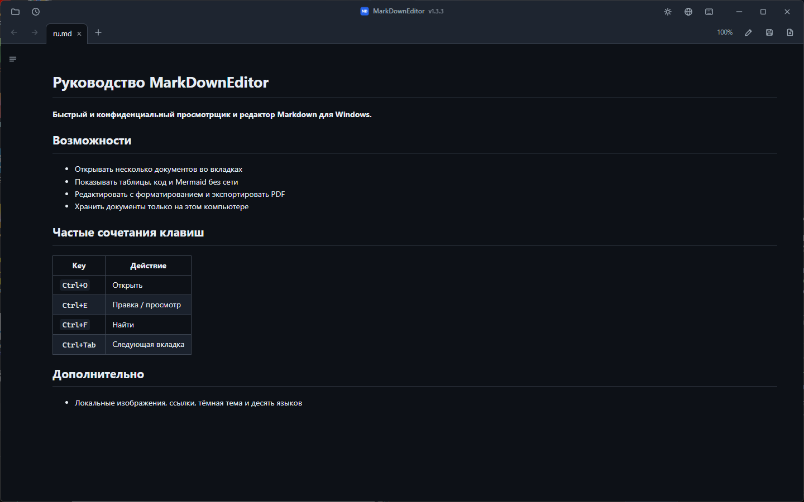
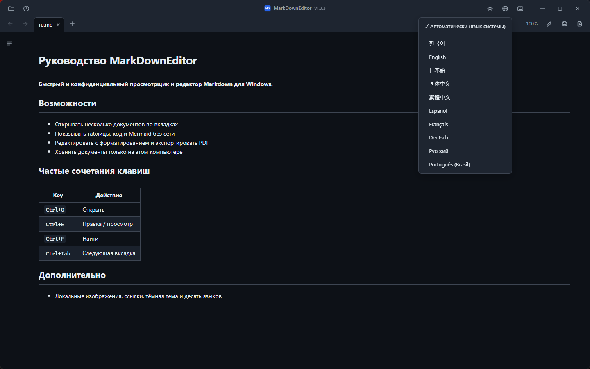

# MarkDownEditor

MarkDownEditor — просмотрщик и редактор Markdown для Windows 10 и 11. Доступны установщик и портативный ZIP; учётная запись и телеметрия не используются.

[한국어](README.ko.md) · [English](README.md) · [日本語](README.ja.md) · [简体中文](README.zh-CN.md) · [繁體中文](README.zh-TW.md) · [Español](README.es.md) · [Français](README.fr.md) · [Deutsch](README.de.md) · **Русский** · [Português (Brasil)](README.pt-BR.md)

### [Скачать через GitHub Releases](https://github.com/jjw1270/MarkdownEditor/releases/latest)

## Возможности

- **Два пакета** — установщик интегрирует приложение в Windows для текущего пользователя. Портативный ZIP содержит WebView2 и при возможности хранит данные рядом с исполняемым файлом.
- **Автообновление** — при запуске приложение анонимно проверяет GitHub Releases. Загрузка начинается только после выбора обновления; документы при этом не передаются.
- **Одно окно, много вкладок** — каждый файл открывается вкладкой в одном окне. Вкладки переставляются перетаскиванием и переключаются `Ctrl+Tab`.
- **Ссылки в документах** — ссылки на `.md` открываются в новой вкладке, веб-ссылки — в браузере, папки — в проводнике, поддерживаемые документы — в приложениях по умолчанию. Поддерживаются якоря между документами (`doc.md#раздел`).
- **Назад / Вперёд** — кнопки панели, `Alt+←`/`Alt+→` или 4-я/5-я кнопки мыши.
- **Отрисовка в стиле GitHub** — таблицы, подсветка кода (офлайн) и **диаграммы mermaid** (офлайн, с учётом темы).
- **Боковая панель оглавления** — с подсветкой текущего раздела при прокрутке (scroll-spy).
- **Редактирование ↔ Просмотр** — `Ctrl+E`, позиция прокрутки синхронизируется между режимами.
- **Панель форматирования** — вставляет жирный текст, заголовки, списки, чекбоксы, цитаты, код, ссылки, таблицы и разделители. Изменения отменяются с помощью `Ctrl+Z`.
- **Контекстные меню** — правый клик в просмотре (копировать, открыть ссылку, копировать адрес, открыть изображение, найти) или в редакторе (вырезать/копировать/вставить/выделить всё).
- **Поиск / Замена** — `Ctrl+F` работает и в просмотре (подсветка всех совпадений), и в редактировании; `Ctrl+H` — замена в режиме редактирования.
- **Экспорт в PDF** — кнопка `📄` рядом с «Сохранить» или `Ctrl+P`, всегда в светлой теме.
- **Вставка изображений из буфера** — сохраняются в папку `images/` рядом с документом, ссылка вставляется автоматически.
- **Автообновление при внешних изменениях** — правки из других программ (IDE, редактор) обновляют открытую вкладку; несохранённые изменения никогда не перезаписываются молча.
- **Автосохранение и восстановление после сбоя** — несохранённые изменения снимаются каждые 30 с и предлагаются к восстановлению при следующем запуске.
- **Восстановление сеанса** — при запуске без файла открываются вкладки прошлого сеанса. Недавние файлы — по кнопке 🕘.
- **Определение корейских кодировок** — файлы CP949/EUC-KR без BOM открываются корректно наравне с UTF-8.
- **Тёмная / светлая тема** — переключается кнопкой `🌙`/`☀` в заголовке окна, запоминается между запусками, включая заголовок окна Windows.
- **Интерфейс на 10 языках** — 한국어, English, 日本語, 简体中文, 繁體中文, Español, Français, Deutsch, Русский, Português. По умолчанию — язык системы; переключение в любой момент кнопкой `🌐`.
- **Масштаб только документа** — `Ctrl+колесо` меняет размер текста предпросмотра и редактора, не увеличивая вкладки и панели. Щёлкните процент, чтобы открыть кнопки `−`/`+`; среднее значение или `Ctrl+0` возвращает 100 %. Масштаб сохраняется между запусками.
- **Справка по горячим клавишам** — кнопка клавиатуры в заголовке или `Ctrl+/` показывает основные сочетания, не покидая документ.
- **Компактный интерфейс в стиле «Блокнота»** — вкладки и инструменты встроены в собственный заголовок окна (перетаскивайте пустую область для перемещения, двойной щелчок — развернуть).

## Установка

Доступны два пакета для Windows 10 версии 1809 и новее или Windows 11 (x64). Права администратора не нужны.

| Пакет | Для чего | Размер | Среда и данные |
|---|---|---:|---|
| **Установщик Windows** | Обычное ежедневное использование | около 45 МБ | Установка для текущего пользователя, автоматически обслуживаемый Evergreen WebView2, меню «Пуск» и «Открыть с помощью». Данные в `%LOCALAPPDATA%\MarkDownEditor`. Интернет нужен только при отсутствии WebView2; если компонент не устанавливается, Setup сообщает об ошибке. |
| **Портативный ZIP** | USB, офлайн и без установки | около 325 МБ | Включает WebView2 Fixed Runtime; данные хранятся рядом с приложением, если папка доступна для записи. |

### Портативный вариант

| | |
|---|---|
| **Размер** | около 325 МБ — полная среда WebView2 включена для автономной работы |
| **Требования** | Windows 10 или 11, 64-разрядная. Больше ничего. |
| **Ещё** | [Все выпуски](https://github.com/jjw1270/MarkdownEditor/releases) · [Что нового в этой версии](https://github.com/jjw1270/MarkdownEditor/releases/latest) · [Полная история изменений](CHANGELOG.md) |

### Шаг 2 — Распаковать и запустить

Распакуйте папку в любое место, куда есть право записи: `C:\Tools\MarkDownEditor`, рабочий стол, USB-флешка — не важно. Затем запустите **`MarkDownEditor.exe`**.

В папке рядом с `MarkDownEditor.exe` лежат `web/` (интерфейс), `Runtime/` (встроенный WebView2) и `WebView2Data/` (кэш). Пока они вместе, всю папку можно переносить, копировать и брать с собой куда угодно.

> **Синее окно SmartScreen при первом запуске — это нормально.** Файл не подписан, поэтому Windows показывает «Система Windows защитила ваш компьютер». Нажмите **Подробнее → Выполнить в любом случае**. Появляется только один раз.
> Если вы предпочитаете собрать приложение самостоятельно, см. отдельное [руководство разработчика на английском](DEVELOPMENT.md).

### Шаг 3 — Назначить приложением по умолчанию для `.md`

После этого двойной клик по любому Markdown-файлу в проводнике сразу открывает готовый отрисованный документ.

1. Правый клик по любому файлу `.md` в проводнике
2. **Открыть с помощью → Выбрать другое приложение**
3. Выберите `MarkDownEditor.exe` — если его нет в списке, прокрутите вниз и нажмите **Выбрать приложение на этом компьютере**
4. Отметьте **Всегда использовать это приложение для открытия файлов .md**, затем **ОК**

Так же можно связать `.markdown` и `.txt`.

### Обновление

При запуске приложение анонимно проверяет GitHub Releases. После нажатия **Обновить** проверяются URL, размер, SHA-256, структура пакета и версия. Портативная редакция атомарно заменяет ZIP, установленная запускает следующий проверенный установщик. Настройки и сессия сохраняются.

### Удаление

- **Установленная редакция:** удалите через **Параметры → Приложения → Установленные приложения**. Программа, ярлыки и собственные записи «Открыть с помощью» удаляются; `%LOCALAPPDATA%\MarkDownEditor` сохраняется для безопасной переустановки.
- **Портативная редакция:** удалите папку приложения; после запуска из папки только для чтения удалите также `%TEMP%\MarkDownEditor`.

## Горячие клавиши

| Клавиша | Действие |
|------|------|
| `Ctrl+O` | Открыть (можно несколько) |
| `Ctrl+N` | Новая вкладка документа |
| `Ctrl+S` | Сохранить |
| `Ctrl+P` | Экспорт в PDF |
| `Ctrl+E` | Переключить редактирование / просмотр |
| `Ctrl+F` / `Ctrl+H` | Найти / Заменить |
| `Ctrl+B` / `Ctrl+I` | Жирный / курсив (режим редактирования, повторное нажатие снимает) |
| `Ctrl+K` | Вставить ссылку (режим редактирования — адрес сразу выделен) |
| `Tab` / `Shift+Tab` | Увеличить / уменьшить отступ (для нескольких строк) |
| `Ctrl+Tab` / `Ctrl+Shift+Tab` | Следующая / предыдущая вкладка |
| `Ctrl+W` | Закрыть вкладку |
| `Ctrl+колесо` / `Ctrl++` / `Ctrl+-` | Увеличить / уменьшить документ (масштаб сохраняется) |
| `Ctrl+0` | Сбросить масштаб документа до 100 % |
| `Ctrl+/` | Показать горячие клавиши |
| `Alt+←` / `Alt+→` | Назад / Вперёд |

## Конфиденциальность

- Документы обрабатываются локально и не загружаются в сеть. Телеметрии и идентификаторов нет.
- Во время работы сеть используется только для проверки GitHub Releases и загрузки обновления, начатой пользователем. При первой установке Setup может скачать WebView2 с серверов Microsoft, если компонента нет в Windows.
- Установленная редакция хранит данные в `%LOCALAPPDATA%\MarkDownEditor`; портативная — в `WebView2Data/` или `%TEMP%\MarkDownEditor`, если папка доступна только для чтения.
- Предпросмотр блокирует исполняемое содержимое и не загружает удалённые изображения автоматически. Локальные изображения остаются на компьютере.

## Обратная связь

Сообщения об ошибках и предложения функций принимаются в [GitHub Issues](https://github.com/jjw1270/MarkdownEditor/issues/new/choose) — или щёлкните номер версии рядом с заголовком прямо в приложении (форма отчёта об ошибке заполняется вашей текущей версией автоматически).

## Лицензия

MIT — см. [LICENSE](LICENSE). Сторонние компоненты перечислены в
[THIRD-PARTY-NOTICES.md](THIRD-PARTY-NOTICES.md).
