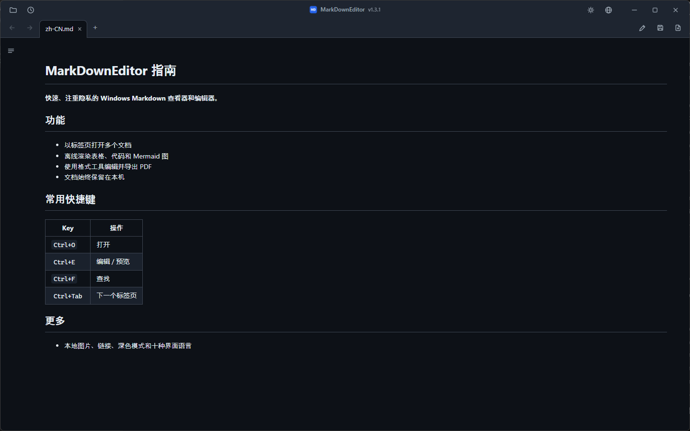
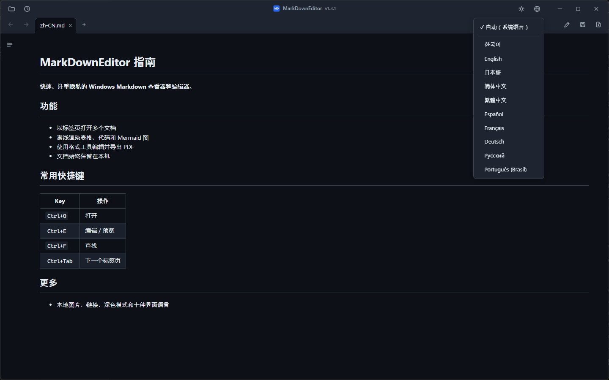

# MarkDownEditor

MarkDownEditor 是适用于 Windows 10 和 11 的 Markdown 查看器与编辑器，提供安装程序和便携 ZIP，不需要账户，也不收集遥测数据。

[](LICENSE)


[](https://github.com/jjw1270/MarkdownEditor/releases)
[](https://github.com/jjw1270/MarkdownEditor/releases)

[한국어](README.ko.md) · [English](README.md) · [日本語](README.ja.md) · **简体中文** · [繁體中文](README.zh-TW.md) · [Español](README.es.md) · [Français](README.fr.md) · [Deutsch](README.de.md) · [Русский](README.ru.md) · [Português (Brasil)](README.pt-BR.md)

### [Windows 安装程序](https://github.com/jjw1270/MarkdownEditor/releases/latest/download/MarkDownEditor-Setup-x64.exe) &nbsp;·&nbsp; [便携 ZIP](https://github.com/jjw1270/MarkdownEditor/releases/latest/download/MarkDownEditor-standalone.zip) &nbsp;·&nbsp; <sub>[查看更新内容](https://github.com/jjw1270/MarkdownEditor/releases/latest)</sub>



## 功能

- **两种软件包** — 安装程序为当前用户注册 Windows 集成；便携 ZIP 内置 WebView2，并在目录可写时把数据保存在可执行文件旁边。
- **自动更新** — 启动时匿名查询 GitHub Releases。只有用户选择更新后才会下载，文档不会被发送。
- **一个窗口，多个标签页** — 所有文件都在同一窗口中以标签页打开（互斥体 + 命名管道实现单实例）。标签页可拖拽排序，`Ctrl+Tab` 循环切换。
- **文档链接** — `.md` 链接在新标签页打开，网页链接用浏览器，文件夹用资源管理器，支持的文档用默认应用打开。支持跨文档锚点（`doc.md#章节`）。
- **后退 / 前进** — 工具栏按钮、`Alt+←`/`Alt+→`，或鼠标第 4/5 键。
- **GitHub 风格渲染** — 表格、代码高亮（离线）、**mermaid 图表**（离线、跟随主题）。
- **目录侧边栏** — 随阅读位置自动高亮当前章节（scroll-spy）。
- **编辑 ↔ 预览** — `Ctrl+E` 切换，两种模式间滚动位置保持同步。
- **格式栏** — 可插入加粗、标题、列表、复选框、引用、代码、链接、表格和分隔线，修改可用 `Ctrl+Z` 撤销。
- **右键菜单** — 预览区（复制、打开链接、复制链接地址、查看图片、查找），编辑区（剪切 / 复制 / 粘贴 / 全选）。
- **查找 / 替换** — `Ctrl+F` 在预览（全部匹配高亮）和编辑模式下均可用；`Ctrl+H` 在编辑模式下替换。
- **导出 PDF** — 保存按钮旁的 `📄`，或 `Ctrl+P`，始终以浅色主题输出。
- **从剪贴板粘贴图片** — 保存到文档旁的 `images/` 文件夹并自动插入链接。
- **外部修改自动刷新** — 其他程序（IDE、编辑器）保存后，已打开的标签页自动更新；未保存的编辑绝不会被悄悄覆盖。
- **自动备份 & 崩溃恢复** — 每 30 秒对未保存的更改做快照，下次启动时提示恢复。
- **会话恢复** — 不带文件启动时，重新打开上次的标签页。最近的文件可从 🕘 按钮打开。
- **韩文编码检测** — 无 BOM 的 CP949/EUC-KR 文件与 UTF-8 一样正常打开。
- **深色 / 浅色主题** — 标题栏 `🌙`/`☀` 按钮切换，记忆上次选择，Windows 标题栏同步变色。
- **界面 10 种语言** — 한국어、English、日本語、简体中文、繁體中文、Español、Français、Deutsch、Русский、Português。默认跟随系统语言，可随时在标题栏 `🌐` 按钮中切换。
- **记事本式紧凑界面** — 标签页与工具集成在自定义标题栏中（拖动空白区域移动窗口，双击最大化）。



## 安装

提供适用于 Windows 10 1809 或更高版本 / Windows 11 x64 的两种包，均不需要管理员权限。

| 软件包 | 适合场景 | 大小 | Runtime 与数据 |
|---|---|---:|---|
| **[Windows 安装程序](https://github.com/jjw1270/MarkdownEditor/releases/latest/download/MarkDownEditor-Setup-x64.exe)** | 日常使用 | 约 45 MB | 按用户安装，使用自动维护的 Evergreen WebView2，并注册开始菜单和“打开方式”。数据位于 `%LOCALAPPDATA%\MarkDownEditor`。仅在缺少 WebView2 时需要联网；若前置组件安装失败，安装程序会明确报错。 |
| **[便携 ZIP](https://github.com/jjw1270/MarkdownEditor/releases/latest/download/MarkDownEditor-standalone.zip)** | U 盘、离线、免安装 | 约 325 MB | 包含 WebView2 Fixed Runtime；位置可写时，数据保存在应用旁边。 |

### 便携版

**⬇️ [MarkDownEditor-standalone.zip](https://github.com/jjw1270/MarkdownEditor/releases/latest/download/MarkDownEditor-standalone.zip)** — 此链接**始终指向最新版本**。

| | |
|---|---|
| **体积** | 约 325 MB — 内置完整 WebView2，适合离线使用 |
| **系统要求** | Windows 10 / 11（64 位）。除此之外别无要求。 |
| **更多** | [全部版本](https://github.com/jjw1270/MarkdownEditor/releases) · [本次更新内容](https://github.com/jjw1270/MarkdownEditor/releases/latest) · [完整更新日志](CHANGELOG.md) |

<details>
<summary><b>习惯用命令行？</b> 一段 PowerShell 完成下载、解压和启动</summary>

```powershell
$dest = "$env:LOCALAPPDATA\Programs\MarkDownEditor-Portable"
$zip  = "$env:TEMP\MarkDownEditor-standalone.zip"

Invoke-WebRequest "https://github.com/jjw1270/MarkdownEditor/releases/latest/download/MarkDownEditor-standalone.zip" -OutFile $zip
Expand-Archive $zip -DestinationPath $dest -Force
Remove-Item $zip

Start-Process "$dest\MarkDownEditor.exe"
```

以后升级时再跑一遍同样的代码即可，也可以直接用下面说的**应用内自动更新**。

</details>

### 第 2 步 — 解压并运行

解压到任何有写入权限的位置都可以：`C:\Tools\MarkDownEditor`、桌面、U 盘都行。然后运行 **`MarkDownEditor.exe`**。

文件夹里除了 `MarkDownEditor.exe`，还有 `web/`（界面）、`Runtime/`（内置 WebView2）和 `WebView2Data/`（缓存）。把它们放在一起，整个文件夹可以随意移动、复制，或者拷进 U 盘在别的电脑上直接使用。

> **首次运行时弹出的蓝色 SmartScreen 窗口属于正常现象。** 程序未经代码签名，所以 Windows 会提示"Windows 已保护你的电脑"。点击 **更多信息 → 仍要运行** 即可，只会出现这一次。
> 如果不愿运行未签名的程序，从源码自己构建只需两条命令 — 见下方 *从源码构建*。

### 第 3 步 — 设为 `.md` 的默认应用

设置一次之后，在资源管理器里双击任何 Markdown 文件，都会立刻打开渲染好的文档。

1. 在资源管理器中**右键**任意 `.md` 文件
2. **打开方式 → 选择其他应用**
3. 在列表中选择 `MarkDownEditor.exe` — 如果找不到，向下滚动并使用 **在这台电脑上选择应用**
4. 勾选 **始终使用此应用打开 .md 文件**，然后点 **确定**

`.markdown` 和 `.txt` 也可以用同样的方法关联。

### 更新

应用启动时会匿名检查 GitHub Releases。点击**更新**后会验证 URL、大小、SHA-256、包结构和版本。便携版会原子替换 ZIP，安装版会运行下一版已验证的安装程序；设置与会话均会保留。

### 卸载

- **安装版：** 在**设置 → 应用 → 已安装的应用**中卸载。程序、快捷方式及自身的“打开方式”注册项会被移除；`%LOCALAPPDATA%\MarkDownEditor` 会保留，便于安全重装。
- **便携版：** 删除应用文件夹；若曾从只读位置运行，也请删除 `%TEMP%\MarkDownEditor`。

## 键盘快捷键

| 按键 | 操作 |
|------|------|
| `Ctrl+O` | 打开（支持多选） |
| `Ctrl+N` | 新建文档标签页 |
| `Ctrl+S` | 保存 |
| `Ctrl+P` | 导出为 PDF |
| `Ctrl+E` | 编辑 / 预览切换 |
| `Ctrl+F` / `Ctrl+H` | 查找 / 替换 |
| `Ctrl+B` / `Ctrl+I` | 加粗 / 斜体（编辑模式，可切换） |
| `Ctrl+K` | 插入链接（编辑模式 — 地址部分处于选中状态） |
| `Tab` / `Shift+Tab` | 增加 / 减少缩进（支持多行） |
| `Ctrl+Tab` / `Ctrl+Shift+Tab` | 下一个 / 上一个标签页 |
| `Ctrl+W` | 关闭标签页 |
| `Alt+←` / `Alt+→` | 后退 / 前进 |

## 隐私

- 文档仅在本地处理，从不上传；没有遥测或标识符。
- 应用运行时，网络仅用于匿名检查 GitHub Releases 和下载你主动开始的更新。首次安装时，若 Windows 缺少 WebView2，安装程序可能从 Microsoft 下载该组件。
- 安装版数据位于 `%LOCALAPPDATA%\MarkDownEditor`；便携版使用 `WebView2Data/`，只读位置则回退到 `%TEMP%\MarkDownEditor`。
- 严格的内容安全策略会阻止脚本、插件、基准 URL 修改和远程图片自动请求；本地图片始终在本地嵌入。

## 从源码构建

```powershell
cd src
dotnet publish -c Release -r win-x64 --self-contained true `
  -p:PublishSingleFile=true -p:IncludeNativeLibrariesForSelfExtract=true
```

输出：`src/bin/Release/net10.0-windows/win-x64/publish/MarkDownEditor.exe`
将 `web/` 文件夹（以及可选的 WebView2 固定版本运行时 `Runtime/`）放在 exe 旁边即可。

### 架构一览

C#（WPF）端负责文件读写、单实例管道和窗口外壳；Web 端（单个 WebView2 中的原生 JS）拥有全部文档缓冲区和标签页状态。两者仅通过 `postMessage` 通信。渲染使用 marked + highlight.js + mermaid，全部离线内置。完整功能介绍请参阅 [README.ko.md](README.ko.md)（韩语）或 [README.md](README.md)（英语）。

## 反馈

欢迎在 [GitHub Issues](https://github.com/jjw1270/MarkdownEditor/issues/new/choose) 报告问题或提出功能建议——也可以在应用内点击标题旁的版本号直接前往（问题报告表单会自动填入当前版本）。

## 许可证

MIT — 参见 [LICENSE](LICENSE)。内置的第三方组件见
[THIRD-PARTY-NOTICES.md](THIRD-PARTY-NOTICES.md)（注：mermaid 包含一个已记录的小型本地补丁）。
