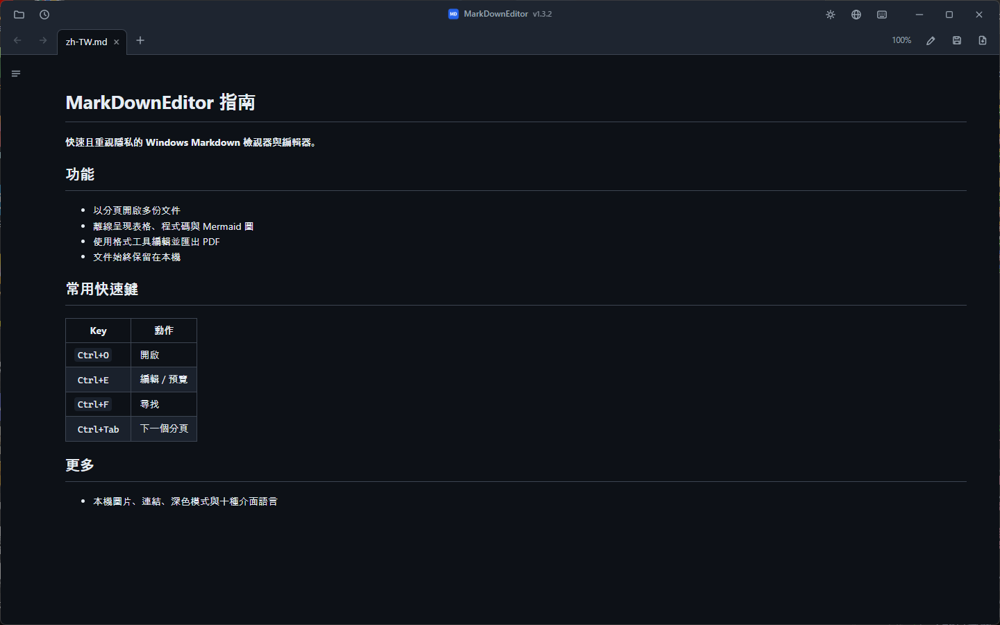
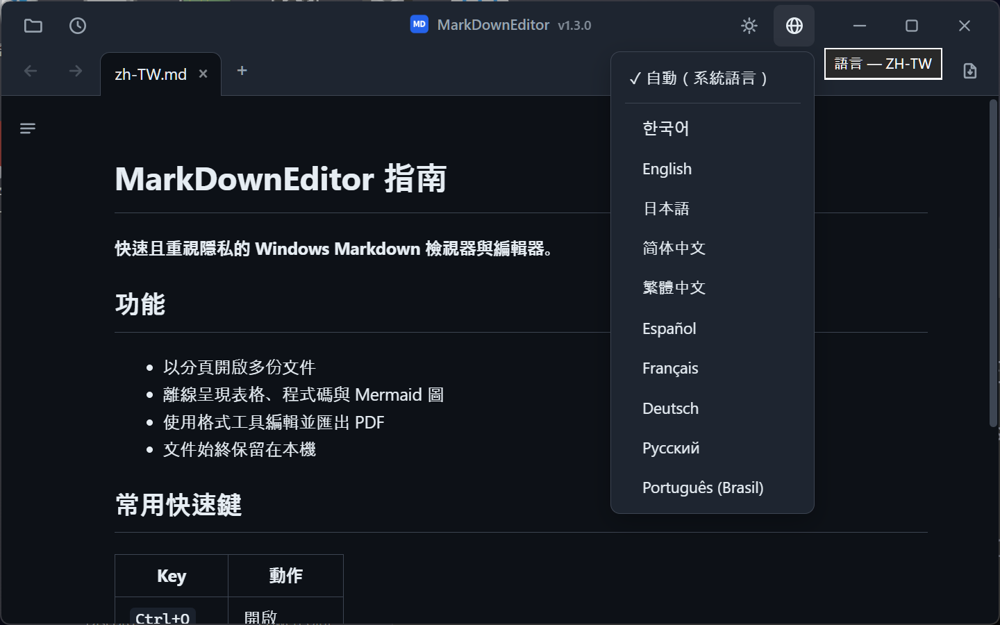

# MarkDownEditor

MarkDownEditor 是適用於 Windows 10 和 11 的 Markdown 檢視器與編輯器，提供安裝程式和可攜式 ZIP，不需要帳號，也不收集遙測資料。

[](LICENSE)


[](https://github.com/jjw1270/MarkdownEditor/releases)
[](https://github.com/jjw1270/MarkdownEditor/releases)

[한국어](README.ko.md) · [English](README.md) · [日本語](README.ja.md) · [简体中文](README.zh-CN.md) · **繁體中文** · [Español](README.es.md) · [Français](README.fr.md) · [Deutsch](README.de.md) · [Русский](README.ru.md) · [Português (Brasil)](README.pt-BR.md)



## 功能

- **兩種套件** — 安裝程式為目前使用者註冊 Windows 整合；可攜式 ZIP 內建 WebView2，並在資料夾可寫入時將資料保存在執行檔旁邊。
- **自動更新** — 啟動時匿名查詢 GitHub Releases。只有使用者選擇更新後才會下載，文件不會被傳送。
- **一個視窗，多個分頁** — 所有檔案都在同一視窗中以分頁開啟。分頁可拖曳排序，`Ctrl+Tab` 循環切換。
- **文件連結** — `.md` 連結在新分頁開啟，網頁連結用瀏覽器，資料夾用檔案總管，支援的文件用預設應用程式開啟。支援跨文件錨點（`doc.md#章節`）。
- **上一頁 / 下一頁** — 工具列按鈕、`Alt+←`/`Alt+→`，或滑鼠第 4/5 鍵。
- **GitHub 風格渲染** — 表格、程式碼標示（離線）、**mermaid 圖表**（離線、跟隨主題）。
- **目錄側邊欄** — 隨閱讀位置自動標示目前章節（scroll-spy）。
- **編輯 ↔ 預覽** — `Ctrl+E` 切換，兩種模式間捲動位置保持同步。
- **格式列** — 可插入粗體、標題、清單、核取方塊、引用、程式碼、連結、表格和分隔線，修改可用 `Ctrl+Z` 復原。
- **右鍵選單** — 預覽區（複製、開啟連結、複製連結位址、檢視圖片、尋找），編輯區（剪下 / 複製 / 貼上 / 全選）。
- **尋找 / 取代** — `Ctrl+F` 在預覽（全部相符標示）和編輯模式下均可用；`Ctrl+H` 在編輯模式下取代。
- **匯出 PDF** — 儲存按鈕旁的 `📄`，或 `Ctrl+P`，一律以淺色主題輸出。
- **從剪貼簿貼上圖片** — 儲存到文件旁的 `images/` 資料夾並自動插入連結。
- **外部修改自動重新載入** — 其他程式（IDE、編輯器）儲存後，已開啟的分頁自動更新；未儲存的編輯絕不會被悄悄覆寫。
- **自動備份 & 當機復原** — 每 30 秒對未儲存的變更做快照，下次啟動時提示復原。
- **工作階段還原** — 不帶檔案啟動時，重新開啟上次的分頁。最近的檔案可從 🕘 按鈕開啟。
- **韓文編碼偵測** — 無 BOM 的 CP949/EUC-KR 檔案與 UTF-8 一樣正常開啟。
- **深色 / 淺色主題** — 標題列 `🌙`/`☀` 按鈕切換，記住上次選擇，Windows 標題列同步變色。
- **介面 10 種語言** — 한국어、English、日本語、简体中文、繁體中文、Español、Français、Deutsch、Русский、Português。預設跟隨系統語言，可隨時在標題列 `🌐` 按鈕中切換。
- **僅文件縮放** — `Ctrl+滾輪` 只縮放預覽與編輯器文字，不改變分頁或工具列。點擊縮放百分比或按 `Ctrl+0` 可恢復 100%，並在下次啟動時保留。
- **快速鍵一覽** — 點擊標題列的鍵盤按鈕或按 `Ctrl+/`，不離開文件即可查看主要快速鍵。
- **記事本式精簡介面** — 分頁與工具整合在自訂標題列中（拖曳空白區域移動視窗，雙擊最大化）。



## 安裝

提供適用於 Windows 10 1809 或更新版本 / Windows 11 x64 的兩種套件，皆不需要系統管理員權限。

| 套件 | 適合用途 | 大小 | Runtime 與資料 |
|---|---|---:|---|
| **[Windows 安裝程式](https://github.com/jjw1270/MarkdownEditor/releases/latest/download/MarkDownEditor-Setup-x64.exe)** | 一般日常使用 | 約 45 MB | 依使用者安裝，採用自動維護的 Evergreen WebView2，並登錄開始功能表與「開啟檔案」。資料位於 `%LOCALAPPDATA%\MarkDownEditor`。僅在缺少 WebView2 時需要網路連線；若必要元件安裝失敗，安裝程式會明確報錯。 |
| **[可攜式 ZIP](https://github.com/jjw1270/MarkdownEditor/releases/latest/download/MarkDownEditor-standalone.zip)** | USB、離線、免安裝 | 約 325 MB | 內含 WebView2 Fixed Runtime；位置可寫入時，資料保存在應用程式旁。 |

### 可攜式版本

**⬇️ [MarkDownEditor-standalone.zip](https://github.com/jjw1270/MarkdownEditor/releases/latest/download/MarkDownEditor-standalone.zip)** — 這個連結**永遠指向最新版本**。

| | |
|---|---|
| **檔案大小** | 約 325 MB — 內建完整 WebView2，適合離線使用 |
| **系統需求** | Windows 10 / 11（64 位元）。除此之外別無要求。 |
| **更多** | [所有版本](https://github.com/jjw1270/MarkdownEditor/releases) · [本次更新內容](https://github.com/jjw1270/MarkdownEditor/releases/latest) · [完整變更紀錄](CHANGELOG.md) |

<details>
<summary><b>習慣用終端機？</b> 一段 PowerShell 完成下載、解壓縮與啟動</summary>

```powershell
$dest = "$env:LOCALAPPDATA\Programs\MarkDownEditor-Portable"
$zip  = "$env:TEMP\MarkDownEditor-standalone.zip"

Invoke-WebRequest "https://github.com/jjw1270/MarkdownEditor/releases/latest/download/MarkDownEditor-standalone.zip" -OutFile $zip
Expand-Archive $zip -DestinationPath $dest -Force
Remove-Item $zip

Start-Process "$dest\MarkDownEditor.exe"
```

之後要更新時再執行一次同樣的程式碼即可，也可以直接用下面說明的**應用程式內自動更新**。

</details>

### 步驟 2 — 解壓縮並執行

解壓縮到任何有寫入權限的位置都可以：`C:\Tools\MarkDownEditor`、桌面、USB 隨身碟都行。接著執行 **`MarkDownEditor.exe`**。

資料夾中除了 `MarkDownEditor.exe`，還有 `web/`（介面）、`Runtime/`（內建 WebView2）與 `WebView2Data/`（快取）。把它們放在一起，整個資料夾可以隨意搬移、複製，或放進隨身碟在別台電腦上直接使用。

> **首次執行時跳出的藍色 SmartScreen 視窗是正常的。** 程式未經程式碼簽署，因此 Windows 會顯示「Windows 已保護您的電腦」。點選 **其他資訊 → 仍要執行** 即可，只會出現這一次。
> 如果希望自行建置，請參閱獨立的[英文開發文件](DEVELOPMENT.md)。

### 步驟 3 — 設為 `.md` 的預設應用程式

設定一次之後，在檔案總管中雙擊任何 Markdown 檔案，都會立刻開啟渲染好的文件。

1. 在檔案總管中**右鍵**任一 `.md` 檔案
2. **開啟方式 → 選擇其他應用程式**
3. 從清單中選擇 `MarkDownEditor.exe` — 若找不到，往下捲動並使用 **在這部電腦上選擇應用程式**
4. 勾選 **一律使用此應用程式開啟 .md 檔案**，然後按 **確定**

`.markdown` 與 `.txt` 也可以用同樣的方式關聯。

### 更新

應用程式啟動時會匿名檢查 GitHub Releases。按下**更新**後會驗證 URL、大小、SHA-256、套件結構與版本。可攜式版本會原子替換 ZIP，安裝版會執行下一版已驗證的安裝程式；設定與工作階段都會保留。

### 解除安裝

- **安裝版：** 從**設定 → 應用程式 → 已安裝的應用程式**移除。程式、捷徑與自身的「開啟檔案」登錄會刪除；`%LOCALAPPDATA%\MarkDownEditor` 會保留以便安全重裝。
- **可攜式版本：** 刪除應用程式資料夾；若曾從唯讀位置執行，也請刪除 `%TEMP%\MarkDownEditor`。

## 鍵盤快速鍵

| 按鍵 | 動作 |
|------|------|
| `Ctrl+O` | 開啟（支援多選） |
| `Ctrl+N` | 新增文件分頁 |
| `Ctrl+S` | 儲存 |
| `Ctrl+P` | 匯出為 PDF |
| `Ctrl+E` | 編輯 / 預覽切換 |
| `Ctrl+F` / `Ctrl+H` | 尋找 / 取代 |
| `Ctrl+B` / `Ctrl+I` | 粗體 / 斜體（編輯模式，可切換） |
| `Ctrl+K` | 插入連結（編輯模式 — 位址部分處於選取狀態） |
| `Tab` / `Shift+Tab` | 增加 / 減少縮排（支援多行） |
| `Ctrl+Tab` / `Ctrl+Shift+Tab` | 下一個 / 上一個分頁 |
| `Ctrl+W` | 關閉分頁 |
| `Ctrl+滾輪` / `Ctrl++` / `Ctrl+-` | 放大 / 縮小文件（下次啟動時保留） |
| `Ctrl+0` | 將文件縮放恢復為 100% |
| `Ctrl+/` | 檢視鍵盤快速鍵 |
| `Alt+←` / `Alt+→` | 上一頁 / 下一頁 |

## 隱私

- 文件只在本機處理，絕不會上傳；沒有遙測或識別碼。
- 應用程式執行時，網路僅用於匿名檢查 GitHub Releases 和下載你主動開始的更新。首次安裝時，若 Windows 缺少 WebView2，安裝程式可能從 Microsoft 下載該元件。
- 安裝版資料位於 `%LOCALAPPDATA%\MarkDownEditor`；可攜式版本使用 `WebView2Data/`，唯讀位置則退回 `%TEMP%\MarkDownEditor`。
- 預覽會阻擋可執行內容，也不會自動載入遠端圖片。本機圖片始終留在你的電腦上。

## 意見回饋

歡迎到 [GitHub Issues](https://github.com/jjw1270/MarkdownEditor/issues/new/choose) 回報問題或提出功能建議——也可以在應用程式內點選標題旁的版本號直接前往（問題回報表單會自動填入目前版本）。

## 授權

MIT — 參見 [LICENSE](LICENSE)。內建的第三方元件見
[THIRD-PARTY-NOTICES.md](THIRD-PARTY-NOTICES.md)。
